::: {.cover-meta}
**What this document is.** A project-specific technical reference for presenting MEDGUARD to hackathon judges, engineers, clinicians and investors. Every implementation claim is traced to the repository, a test run or a deployment check. External facts are cited. Anything that could not be verified is labelled **NOT VERIFIED**.

**Repository commit inspected:** `99ced8e` (branch `claude/exciting-ramanujan-hvgd64`, which contains the default branch `claude/fervent-euler-bsgy2t` at `ec2fa18`, the commit deployed to production).
:::

# How to read this dossier {#how-to-read}

## Status classification

Every major feature carries one of these labels. They are used consistently in every table and answer.

| Label | Meaning in this dossier |
|---|---|
| [A · IMPLEMENTED AND VERIFIED]{.tag .ta} | Code exists, automated tests pass, **and** it was exercised against the live deployment or in a recorded CI run on 9 Oct 2026. |
| [B · IMPLEMENTED, NOT LIVE-VERIFIED]{.tag .tb} | Code exists and tests pass locally or in CI, but it has not been exercised in the live deployment (for example because a key or setting is absent). |
| [C · PARTIALLY IMPLEMENTED]{.tag .tc} | Some of the capability exists; important parts are missing. |
| [D · PLANNED OR PROPOSED]{.tag .td} | Not in the code. A recommendation or roadmap item. |
| [E · NOT FOUND IN THE CODEBASE]{.tag .te} | Searched for and absent. Do not claim it. |

## Evidence types

| Marker | Source of the statement |
|---|---|
| **[Code]** | Read directly in the repository (file and line references given). |
| **[Test]** | A test that was run for this dossier, or a recorded CI run. |
| **[Live]** | A check against the deployed system (performed by GitHub Actions runners, see Part 2). |
| **[Ext]** | External research, cited in the Sources section. |
| **[Inference]** | Reasoned conclusion, not directly measured. |
| **[Unknown]** | Not measured. Must not be stated as fact. |

::: {.callout .warn}
**Research limitation that affects this dossier.** The sandbox used to prepare this document blocks outbound connections to `github.io`, `onrender.com`, `vercel.app` and most vendor and journal websites. Live checks were therefore taken from **GitHub Actions runs** (which run on GitHub's servers and whose logs were read through the GitHub API), and competitor/background research used **web-search result excerpts** rather than opened pages. Both limitations are marked wherever they matter.
:::

# Part 1 · Project quick reference {#quick-reference}

::: {.factbox}
| | |
|---|---|
| **PROJECT NAME** | MEDGUARD (display name: MedGuard) |
| **PURPOSE** | Healthcare record contradiction detection with evidence and human review |
| **OFFICIAL WEBSITE** | <https://anirudhleetcode-max.github.io/cliniscope-healthcare-contradiction-detector/> — **VERIFIED live** (GitHub Actions, 9 Oct 2026 15:42–15:46 UTC) |
| **SOURCE REPOSITORY** | <https://github.com/anirudhleetcode-max/cliniscope-healthcare-contradiction-detector> |
| **BACKEND (API)** | <https://medguard-api-duti.onrender.com> — **VERIFIED live** (API v1.3.1) |
| **API HEALTH / READINESS** | `/api/health` → 200, version 1.3.1 · `/api/ready` → 200, PostgreSQL reachable, external storage, schema v3 |
| **API DOCUMENTATION** | `/api/openapi.json` (OpenAPI 3 JSON) — route exists in `server/app.ts:174`; **NOT VERIFIED** on the live server |
| **DATABASE** | PostgreSQL on **Neon** (free plan), reached through `DATABASE_URL` — **VERIFIED** (`engine: postgresql`, `storage: external`) |
| **DEPLOYMENT STATUS** | Frontend on GitHub Pages, deployed commit `ec2fa18`; API on Render free web service; database on Neon free. All live checks passed. |
| **LAST VERIFIED** | 9 October 2026, 15:44:27–15:46:37 UTC (Actions run 37953941921) and 15:57:04 UTC (run 37955493004) |
:::

**Not the official website (do not present these as the live app):**

* `https://anirudhleetcode-max.github.io/medguard/`: becomes the URL **only after** the GitHub repository is renamed to `medguard`. On 9 Oct 2026 the repository still had its original name, so this URL is **NOT VERIFIED / not yet live**.
* Vercel: the repository's homepage field points to `https://medguard-sigma.vercel.app`. That URL was **not probed** (NOT VERIFIED). Two other Vercel deployment URLs of the project redirected to a **Vercel login page** (deployment protection), and `https://medguard.vercel.app/` returned **404**, which means it belongs to someone else or does not exist (probe log, 15:57 UTC). Treat Vercel as a **non-public preview channel**.

# Part 2 · Live deployment verification {#live-verification}

## What was checked and how

The repository contains two workflows that test the real deployment with synthetic data:

* **CI and deploy** (`.github/workflows/ci-deploy.yml`) runs on every push. On the default branch it publishes `dist/` to the `gh-pages` branch. Its `verify-production` job then checks that the live site serves this build and runs the end-to-end suite against the live URL.
* **Verify live deployment** (`.github/workflows/verify-live.yml` with `tests/live/verify-api.mts`) runs on demand. It exercises the live API, the live GitHub Pages frontend and persistence.

| Check (9 Oct 2026, UTC) | Result | Evidence |
|---|---|---|
| Default branch | `claude/fervent-euler-bsgy2t` | GitHub repository metadata |
| Latest merged branding commit | `ec2fa18` "Merge PR #7: MedGuard branding across the active site; repository rename prepared" | git history |
| Pages deployment of that commit | gh-pages commit `6d07bc6` "deploy: ec2fa18…", Pages build **success** 15:41:58–15:43:01 | Actions run 37953668207 |
| CI and deploy run 66 for `ec2fa18` | test ✓ · docker-api ✓ · deploy ✓ · verify-production ✓ (live e2e suite 15:42:27–15:43:29) | Actions run 37953179435 |
| Frontend base path | `VITE_BASE_PATH` default `./` (relative assets, HashRouter) | `vite.config.ts`, `.env.example` |
| Page title | `MedGuard — Healthcare Contradiction Detection` | `index.html` |
| Production API base URL | `https://medguard-api-duti.onrender.com` (entered by the user in Settings; not baked into the build) | workflow env, `.env.example` (`VITE_API_BASE_URL` empty) |
| `GET /api/health` | 200 in 168 ms, version **1.3.1** | run 37953941921 log 15:44:27 |
| `GET /api/ready` | 200, `{"reachable":true,"engine":"postgresql","storage":"external","schemaVersion":3,"expectedSchemaVersion":3}` | same run; repeated 15:57:04 by run 37955493004 |
| CORS | Preflight from `https://anirudhleetcode-max.github.io` → 204 with matching origin; other origin → 403 | same run |
| Auth | register ✓ · duplicate 409 ✓ · wrong password 401 ✓ · login ✓ · no token 401 ✓ | same run |
| Detection + storage | 4 synthetic documents → 37 statements → **9 findings**; server re-verified every quote; store took 10.5 s | same run |
| Review | `unreviewed → in_review` ✓, closing without reason → 422 ✓, `→ needs_info` ✓, note ✓ | same run |
| Files | 705-byte original uploaded and downloaded byte-identical | same run |
| Isolation | outsider gets 404 for case, finding, file, status change and activity; cross-case overwrite 409 | same run |
| Audit log | 18 events recorded; not readable by a non-member (404) | same run |
| Live browser test | Two-user shared-workspace Playwright tests on the **live GitHub Pages site** against the live API: **3/3 passed** | same run 15:45:24–15:46:32 |
| Persistence read-back | account, case, 4/37/9 documents/statements/findings, decision, note and file all read back | same run 15:46:33–37 |

::: {.callout .note}
**Honest wording for judges:** "Our live deployment was verified today by automated checks on GitHub's servers: the API health and readiness checks, authentication, detection, review, file storage, case isolation and a two-user browser test on the live site all passed." Do **not** say "we load-tested it" or "it is production-ready".
:::

::: {.callout .warn}
**Caveats.** (1) In run 37953941921 the idle period was set to 0 minutes, so "persistence after restart" was a read-back, not a proven cold restart. A cold restart (22.3 s first response after 17 idle minutes) is documented for an earlier run in `docs/backend/DEPLOYMENT.md`; that earlier run was not re-read for this dossier. (2) The default site opens in **local demo mode**. The backend is used only after a user connects it in **Settings → Shared workspace**. (3) The author of this dossier could not open the site directly (network policy); the check is GitHub's, not a manual visual inspection.
:::

# Part 3 · Complete technology stack inventory {#stack}

All versions were resolved from `package.json` and `package-lock.json` at commit `99ced8e`.

## A. Frontend

| Category | Technology | Purpose | Where used | Why chosen | Status | Evidence |
|---|---|---|---|---|---|---|
| Language | TypeScript 5.6 (strict) | All app, server and test code | `tsconfig.json` | Type safety across browser and server | A | typecheck passes **[Test]** |
| UI framework | React 18.3 | Component UI | `src/main.tsx`, `src/pages/*` | Mature and widely known | A | e2e suite **[Live]** |
| Build tool | Vite 5.4 + `@vitejs/plugin-react` | Dev server, production bundle | `vite.config.ts` | Fast builds, static output | A | CI build ✓ |
| Styling | Tailwind CSS 3.4, PostCSS, Autoprefixer; CSS variables | Design tokens and utility classes | `tailwind.config.js`, `src/index.css` | Consistent design system | A | **[Code]** |
| Components | Custom primitives (`src/components/ui.tsx`), lucide-react icons, Inter Variable font (self-hosted) | UI building blocks | `src/components/*` | No heavy component library; fonts served from own origin (works with the CSP) | A | **[Code]** |
| Routing | react-router-dom 6 `HashRouter` | `#/` routes | `src/main.tsx` | Works under any static sub-path | A | **[Code]** |
| State | React Context (`AppProvider`, `WorkspaceProvider`) + Dexie live queries | App and workspace state | `src/app/state.tsx`, `workspace.tsx` | UI re-renders on every IndexedDB write | A | **[Code]** |
| API communication | Browser `fetch` + `AbortController`, Bearer token | Optional shared workspace | `src/lib/remote.ts` | No client library needed | A | live browser test **[Live]** |
| Form validation | Plain controlled inputs; file validation in `services.ts` (extension, MIME, magic bytes, size, SHA-256 duplicates) | Input checks | `src/lib/extract.ts`, `services.ts` | Uploads are the main untrusted input | A | e2e rejects unsupported/empty files **[Test]** |
| Auth integration | Server login/register; token in `sessionStorage` | Shared workspace | `src/app/workspace.tsx` | Simple bearer sessions | A | **[Live]** |
| Browser storage | IndexedDB via Dexie 4 (+ dexie-react-hooks) | Local cases, files, findings, events | `src/lib/db.ts` | Works offline; no server needed | A | persistence e2e **[Test]** |
| Document parsing | pdfjs-dist 4.10, mammoth 1.8, UTF-8 decoding | PDF text layer, DOCX, TXT | `src/lib/browserExtract.ts`, `extract.ts` | Runs in the browser | A | **[Test]** |
| OCR | tesseract.js 6 (English, `eng` best-int, self-hosted assets) | Scanned PDFs and images | `src/lib/browserOcr.ts` | Data does not leave the device | A | OCR unit + e2e tests **[Test]** |
| Schema validation | zod 4 | AI output and backup-file schemas | `src/lib/ai.ts`, `exportCase.ts` | One validation library across both sides | A | **[Test]** |
| Offline | Hand-written service worker | Offline after first load | `public/sw.js` | No PWA framework needed | A | e2e reload while offline **[Test]** |
| Testing | Vitest 2.1 (+ fake-indexeddb), Playwright 1.56 (desktop and Pixel 7 projects) | Unit, integration, e2e | `tests/` | Real browser coverage | A | 106 + 25 pass **[Test]** |
| Accessibility tooling | None configured (no axe, no lint rules) | — | — | — | E | **[Code]** |

## B. Backend (optional shared-workspace API)

| Category | Technology | Purpose | Where used | Why chosen | Status | Evidence |
|---|---|---|---|---|---|---|
| Language / runtime | TypeScript on Node.js 22 | Server | `server/*.ts`, `Dockerfile` (`node:22-slim`) | Same language as the frontend; the rules engine and review state machine are shared code | A | **[Live]** v1.3.1 |
| Framework | **None**: plain `node:http` with a regex router | HTTP handling | `server/app.ts` | Few dependencies, full control | A | **[Code]** |
| API style / protocol | REST-style JSON over HTTPS; OpenAPI document at `/api/openapi.json` | 29 route registrations (27 endpoints + 2 health aliases) | `server/app.ts:155–541`, `server/openapi.ts` | Simple for a static frontend | A (OpenAPI B) | **[Live]** |
| Request validation | zod schemas; integer query-param checks; body-size limits (25 MB JSON, 10 MB uploads) | Input safety | `server/app.ts` | Readable 400 errors | A | invalid input → 400 **[Live]** |
| Authentication | scrypt password hashing (N=16384), random 32-byte bearer tokens, SHA-256 token hashes stored, 8 h expiry | Accounts | `server/auth.ts` | No secrets stored in plain form | A | **[Live]** |
| Authorization | Per-request role lookup in `case_members` (owner > reviewer > viewer); non-member → 404, low role → 403; archived cases read-only | Case isolation | `server/app.ts` `requireRole` | Cannot probe case IDs | A | isolation checks **[Live]** |
| Business logic | Shared `src/lib/review.ts` state machine; server-side quote re-verification of synced evidence | Review integrity | `server/app.ts` | Server never trusts client evidence | A | **[Live]** |
| Detection on the server | The server **re-verifies** and stores findings produced in the browser; it does not run the detector itself for normal flows | — | snapshot route | Same engine everywhere | A | **[Code]** |
| AI / LLM | `@anthropic-ai/sdk` 0.132, structured outputs with zod, default model id `claude-opus-5-5`, effort `medium`, 120 s timeout, 1 retry | Optional AI-assisted findings | `server/aiProvider.ts` | Server-side key; output must verify | **B** (tested against a local fake provider only; no key on the live server) | **[Code]**, `tests/e2e/ai.spec.ts` |
| Logging | One line per request (`method path status ms`); errors log name only; no document contents | Operations | `server/app.ts` | Privacy by default | A | **[Code]** |
| Rate limiting | In-memory fixed window: login 10 per 15 min, AI 10 per 10 min | Abuse control | `server/auth.ts` `RateLimiter` | Simple | A (per process only) | **[Code]** |
| Testing | Vitest server/backend/sync tests on embedded PGlite and on real PostgreSQL 16 in CI | API and database | `tests/unit/server.test.ts`, `backend.test.ts`, `sync.test.ts` | Real SQL dialect in tests | A | **[Test]** |

## C. Database

| Item | Implementation | Status / evidence |
|---|---|---|
| Engine | **PostgreSQL** (one SQL dialect) | A **[Live]** `engine: postgresql` |
| Hosting provider | **Neon** serverless PostgreSQL, free plan | A (provider identity from `docs/backend/DEPLOYMENT.md` + live `storage: external`; the Neon console itself was not inspected) |
| Drivers | `pg` (node-postgres 8) for external servers; **PGlite** (`@electric-sql/pglite` 0.5) embedded PostgreSQL for local development, tests and self-hosting | A **[Code]** `server/db.ts` |
| ORM / queries | **No ORM.** Hand-written parameterised SQL (`?` converted to `$1…`) | A **[Code]** |
| Schema | `users`, `sessions`, `cases`, `case_members`, `documents`, `document_files` (BYTEA), `statements`, `findings`, `audit_events`, `schema_version` | A **[Code]** |
| Migrations | Versioned v1–v3, applied at start-up inside a transaction under `pg_advisory_xact_lock` | A **[Live]** schema v3 |
| Connection pooling | `pg.Pool` max 5, 15 s connect timeout, 30 s idle timeout; idle-client errors swallowed (Neon scales to zero) | A **[Code]** |
| Transactions | `db.tx()`; case writers serialised with `SELECT … FOR UPDATE` on the case row | A **[Code]** |
| Data isolation | Logical: every query scoped by case and membership. **Not** separate databases or row-level security per tenant | A (logical only) |
| Integrity | CHECK on review status, UNIQUE `(case_id, fingerprint)`, foreign keys with cascade, append-only triggers on `audit_events` (UPDATE/DELETE/TRUNCATE rejected) | A **[Code]**; triggers tested on PostgreSQL 16 in CI |
| TLS | `sslmode=require` upgraded to `verify-full`; channel binding honoured | A **[Code]** `pgConfigFromUrl` |
| Backup / recovery | No automated backup in the app. Neon free plan restore window is short (per docs). Browser side: full backup and validated restore | C |
| Database tests | Same API/DB tests run on embedded PGlite and on a `postgres:16` service container in CI | A **[Test]** |

## D. Deployment and infrastructure

| Item | Implementation | Status |
|---|---|---|
| Frontend hosting | **GitHub Pages** from the `gh-pages` branch (`peaceiris/actions-gh-pages@v4`) | A |
| Second frontend channel | **Vercel** GitHub app (project `medguard`), configured outside the repository; observed deployments require Vercel login | C (exists, not public) |
| Backend hosting | **Render** free web service from `render.yaml` + `Dockerfile` (multi-stage `node:22-slim`, non-root user) | A |
| Database hosting | **Neon** free PostgreSQL | A |
| CI/CD | **GitHub Actions**: `CI and deploy` (test, docker-api, deploy, verify-production) and `Verify live deployment` | A |
| Containerisation | Docker image built in CI; data written through it to an external `postgres:16` with no volume, container replaced, data read back; start-up guard tested | A **[Test]** CI run 66 |
| Domain / DNS | No custom domain. Default `*.github.io` and `*.onrender.com` hosts | — |
| Health / readiness | `/api/health` (liveness + version), `/api/ready` (database reachable + schema version); Render health check = `/api/ready`; Docker `HEALTHCHECK` | A **[Live]** |
| Environment config | `.env.example` (placeholders only); secrets set in the Render dashboard; `MEDGUARD_REQUIRE_DATABASE_URL=true` refuses to start without a database | A |
| Logging / monitoring | stdout request logs on Render. **No metrics, alerting, tracing or uptime monitor** | C |
| Deployment strategy | Push to default branch → test → build → deploy Pages → re-test live. API: Render blueprint auto-deploy (configured in Render, not verifiable from the repo) | A / unknown |

## E. Security controls

| Control | Status | Notes |
|---|---|---|
| Authentication (shared mode) | A | scrypt, hashed tokens, expiry. No MFA, SSO, password reset or email verification (E). |
| Authorization | A | Per-case roles enforced server-side on every request. |
| Input validation | A | zod, file-type magic-byte checks, size limits, malformed JSON → 400. |
| Data isolation | A (logical) | Membership checks; non-members see 404. |
| Secret management | A | Env vars in the Render dashboard; `.env.example` has placeholders; frontend `VITE_*` values are public by design. |
| CORS | A | Exact-origin allow-list; other browser origins get 403. |
| SQL injection | A | Parameterised queries everywhere; no string-built SQL from user input found. |
| File upload validation | A | Extension, MIME, magic bytes, size, duplicate hash, sanitised filenames; server derives MIME from a whitelisted kind. |
| Audit logging | A | Append-only at the database level (triggers). Not cryptographically tamper-evident (hash chain absent, E). |
| Data retention | C | No retention policy or delete route for shared cases/accounts (cases are archived). |
| Rate limiting | C | In memory, per process. Lost on restart; not shared across instances. |
| Encryption in transit | A | HTTPS hosts; verified TLS to PostgreSQL. |
| Encryption at rest | Provider-level only **[Unknown]** for Neon specifics; no application-level encryption (E). Browser data relies on the OS/profile. |
| Content Security Policy | A | `default-src 'self'`; scripts self + wasm; `object-src 'none'`; `form-action 'none'`. `connect-src` allows any HTTPS host (needed for user-entered API URLs). |
| Dependency vulnerabilities | Known issues | `npm audit` (9 Oct 2026): 20 advisories (2 critical, 10 high, 8 moderate). Most are in development tooling (vitest, vite, tailwind chain). Runtime-relevant: `react-router-dom` (high: open-redirect/XSS advisories) and `mammoth` (moderate: directory traversal). Not yet remediated. |
| Formal compliance (HIPAA, GDPR, DPDP Act 2023 etc.) | **None claimed** | No assessment has been made. |

## F. AI and detection engine: what actually happens

**The core engine is deterministic rules, not machine learning.** `src/lib/detect.ts` states: `Deterministic rules v1 (concept normalization + polarity/value/date comparison)`. **[Code]**

1. **Input types:** PDF (text layer), scanned PDF and PNG/JPEG (OCR), TXT, DOCX.
2. **Text extraction:** pdf.js reads each page's text layer. A page with fewer than 20 non-space characters is rendered at about 200 DPI and read by Tesseract.js. DOCX goes through mammoth `extractRawText`; TXT is decoded as UTF-8. Page spans and character offsets are kept.
3. **Statement extraction (rules + vocabulary):** `src/lib/lexicon.ts` has **26 medications, 14 allergens, 12 diagnoses, 10 lab tests and 7 procedures**, plus smoking status and demographics (date of birth). Regular expressions detect:
   * negation in the 40 characters before a term ("no", "denies", "negative for", "ruled out", "never"…);
   * historical language ("history of", "resolved", "as a child");
   * hedging ("possible", "not verified");
   * family history (excluded);
   * documented dose changes ("increased from 10 mg").
4. **Normalisation:** doses are converted to mg (g × 1000, mcg ÷ 1000); concepts are keyed (`lab:potassium`, medication keys); dates are parsed, with ambiguous DD/MM vs MM/DD numeric dates deliberately not parsed.
5. **Comparison:** only statements of the **same concept in the same case**. Allergy presence vs NKDA; medication dose/frequency/status; diagnosis polarity; lab values only for the **same specimen date** (different dates are expected to differ and are not flagged); smoking never/former/current; procedures; date of birth.
6. **Classification:** `explicit_conflict`, `potential_discrepancy`, `temporal_inconsistency`, `context_dependent` (historical/contextual), `insufficient_evidence`.
7. **Evidence:** each finding stores verbatim quotes with document, date, page (only from verified PDF page spans), section, line and offsets. `verifyStatement()` requires `extractedText.slice(start,end) === quote`; otherwise **no finding is created**.
8. **Uncertainty labels (not probabilities):** evidence quality (`high/moderate/limited/insufficient`) describes how complete and reliable the source text is, **not** how likely a statement is to be correct. Review priority (`prompt/routine/low`). OCR evidence is never rated above moderate, and a finding that depends on a word below 70 % OCR confidence becomes `insufficient_evidence`.
9. **No embeddings, no similarity search, no trained model, no confidence calibration.** [E]
10. **Optional LLM layer [B]:**
    * The server sends case text with a fixed system prompt and asks for schema-constrained JSON (`betaZodOutputFormat`).
    * `verifyAiOutput()` keeps a quote only if it appears **verbatim** in the source and takes the text from the source, not from the model. It rejects findings without verifiable quotes, downgrades one-sided conflicts, drops unsupported dates and skips duplicates of rule findings.
    * The browser repeats the verification. AI findings are labelled **AI-assisted**.
    * **Never run against the live model** (no API key configured).
11. **Human review:** every finding starts `unreviewed`. Resolve, dismiss, expected-change, undetermined and reopen require a reason of at least 5 characters (`src/lib/review.ts`).
12. **False positives and negatives: not measured.** No labelled benchmark exists.

## G. Testing: latest verifiable results

| Suite | Tool | Result | When / where |
|---|---|---|---|
| Type check | `tsc --noEmit` | Pass | Local run, commit `99ced8e`, 9 Oct 2026 ~16:10 UTC; CI run 66 |
| Unit + integration (engine, extraction, real OCR, AI verification, services, sync, export, workspace, API server, backend) | Vitest | **106 / 106 passed (10 files)** | Local run; CI run 66 step "Run npm test" ✓ |
| API + database against real PostgreSQL 16 | Vitest + `postgres:16` service | Pass | CI run 66 step ✓ (local run used embedded PGlite) |
| Browser end-to-end (desktop + mobile; OCR, two-user, AI pipeline with fake provider) | Playwright | **25 / 25 passed** | Local run; CI run 66 ✓ |
| Docker | `docker build` + persistence and guard checks | Pass | CI run 66 job `docker-api` ✓ |
| Live production | e2e against GitHub Pages; live API checks; 3 live two-user browser tests | Pass | Runs 37953179435 and 37953941921 |

::: {.callout .warn}
Suites overlap (some API behaviour is tested in both Vitest and Playwright), so **do not add these counts together** as "131 tests of different features". Say "106 automated unit and integration tests and 25 browser tests pass".
:::

# Part 4 · Websites and services used {#services}

This is a **service inventory grouped by role**. The exact historical order of first use cannot be fully reconstructed, although git history shows the frontend first (05:17 UTC), then CI/Pages, then the backend.

| Stage | Confirmed services | Evidence |
|---|---|---|
| 1 · Coding and development | **Claude Code** (claude.ai/code sessions) | 42 of 51 commits carry `Claude-Session: https://claude.ai/code/…` trailers. *The "Claude Code Max" plan tier cannot be verified from the repository.* |
| 2 · Version control | **Git, GitHub** | Remote `github.com/anirudhleetcode-max/…` |
| 3 · Frontend build and preview | **Vite** (local), **Vercel** (preview deployments via its GitHub app) | `vite.config.ts`; Vercel deployment records and probe log |
| 4 · Backend development and hosting | **Render** | `render.yaml`; live API on `onrender.com` |
| 5 · Database | **Neon** (production PostgreSQL); **PGlite** (local); `postgres:16` image (CI) | `DEPLOYMENT.md`; live readiness; `ci-deploy.yml` |
| 6 · Testing and automation | **GitHub Actions**, Vitest, Playwright, Docker | workflows |
| 7 · Final deployment | **GitHub Pages** (frontend), **Render** (API), **Neon** (database) | Pages build run 37953668207 |
| 8 · Live verification | **GitHub Actions** ("Verify live deployment", "Probe public URLs") | runs 37953941921, 37955493004 |
| Package registry | **npm** | `package-lock.json` |
| Integrated but **not used** in the deployment | **Anthropic API** (optional AI layer) | no `ANTHROPIC_API_KEY` configured |

*Not found:* Supabase, Firebase, AWS, Netlify, Railway, Fly.io, Figma files (only a Figma-ready specification exists in `docs/FIGMA_DESIGN_SYSTEM.md`).

# Part 5 · Executive summary {#executive-summary}

1. **What MEDGUARD is.** A web application that finds *possible* contradictions between a patient's healthcare documents and shows the exact source text behind every flag, so that a qualified person can investigate and record a decision.
2. **The problem.** Clinical facts such as allergies, medications, doses, diagnoses, lab values and dates of birth are repeated across many documents. Copies drift apart, and reviewers must compare them by hand.
3. **Who experiences it.** Clinicians at admission and discharge, pharmacists doing medication reconciliation, health-information-management and clinical-documentation staff, and quality/safety reviewers. *(These are intended users; no user research has been conducted.)*
4. **Why it matters.** Medication and allergy discrepancies at care transitions are a recognised patient-safety topic. Medication reconciliation is a Joint Commission National Patient Safety Goal (NPSG.03.06.01). See Part 6 for cited sources.
5. **Input.** PDF, scanned PDF, PNG/JPEG, TXT and DOCX documents grouped into a case.
6. **Processing.**
   * Text is extracted in the browser, including OCR for scans.
   * Deterministic rules extract clinical statements with exact character offsets.
   * Statements of the same concept are compared across documents of the same case, taking negation, history, documented changes, units and specimen dates into account.
7. **Output.** Classified findings (explicit conflict, potential discrepancy, temporal inconsistency, historical/contextual difference, insufficient evidence). Each carries verbatim quotes, document, date, page and OCR confidence, and comes with a review workflow, notes, an append-only history and exports.
8. **Why the output is useful.** A reviewer can check each flag in seconds, because the evidence is attached and re-verified. The system never decides which record is right.
9. **Implemented today.**
   * The whole pipeline runs in the browser with no server, and is live on GitHub Pages.
   * An optional multi-user API with PostgreSQL is live on Render + Neon and verified.
   * An optional AI layer is implemented but not enabled.
10. **Still to develop or validate.**
    * Clinical accuracy (precision and recall are unknown).
    * Vocabulary coverage (fixed lists).
    * Security hardening (MFA, retention, monitoring).
    * Evaluation with expert-labelled data, usability testing, compliance work.
    * Any real-world pilot.

## A · One-sentence description

> **MEDGUARD finds possible contradictions across a patient's healthcare documents, shows the exact source quote behind every flag, and leaves the decision to a human reviewer.**

## B · 30-second elevator pitch

> "Patient information is copied across discharge summaries, intake forms, medication lists and lab reports, and those copies don't always agree. One record says penicillin allergy, another says no known drug allergies. MEDGUARD reads the documents, including scanned ones, compares the clinical statements across them and flags possible conflicts. Every flag shows the exact quote, page and date it came from, so a reviewer can verify it in seconds and record a decision. It doesn't diagnose and it doesn't decide who's right. It makes the disagreement visible and traceable."

## C · 90-second hackathon pitch

> "Healthcare records are written by many people at different times. The same fact appears in a discharge summary, a medication reconciliation, an intake form and a lab report. When those copies disagree, someone has to notice, and today that usually means reading every document side by side.
>
> MEDGUARD is an evidence-first contradiction detector built for PS-11R3. You drop in a case's documents: PDFs, scans, images, Word files or plain text. It extracts the text in the browser, using on-device OCR for scans, and rules pull out allergies, medications with doses, diagnoses, lab results, procedures, smoking status and date of birth, each tied to its exact character position.
>
> It then compares like with like across the case. It handles negation ('no history of kidney disease'), documented changes ('increased from 10 mg'), units (1 g equals 1000 mg) and specimen dates, so last month's lab value is not flagged as a conflict with today's.
>
> Every finding is classified (explicit conflict, potential discrepancy, temporal, contextual or insufficient evidence) and shows the verbatim quotes, re-checked against the source. A reviewer confirms, dismisses or asks for more information, always with a reason, and everything goes to an append-only history.
>
> It's live: the static app runs entirely in the browser, and an optional multi-user workspace runs on Render with PostgreSQL on Neon, verified today by automated live checks. What we have *not* done is clinical validation. Our accuracy on real records is unknown, and measuring it with expert-labelled cases is our next step."

# Part 6 · Problem statement {#problem}

## 1. One sentence

> Clinically important facts are recorded repeatedly across separate healthcare documents, and when those records disagree there is often no quick, traceable way to find the disagreement and see exactly where each version came from.

## 2. One paragraph

A patient's allergies, medications, diagnoses, lab results and identifying details are written into many documents by different people at different times: discharge summaries, admission notes, medication lists, intake forms, lab reports, scanned letters. These records can disagree. A drug may be listed as stopped in one document and active in another, an allergy may appear in one and be denied in the next, and two values may be recorded for the same blood test. Finding these disagreements by hand means reading every document side by side, and even after a discrepancy is found, the reviewer must show where each statement came from and record what was decided. MEDGUARD addresses the *detection and traceability* part of this problem. It does not address which statement is clinically correct.

## 3. Detailed analysis (with evidence types)

| Statement | Type |
|---|---|
| Healthcare facts are recorded in multiple document types across care episodes. | General background knowledge |
| Medication reconciliation (comparing medication information across sources to identify and resolve discrepancies) is a required safety practice in accredited US organisations: Joint Commission NPSG.03.06.01, "Maintain and communicate accurate patient medication information." | **[Ext]** S1 |
| A systematic review in *CMAJ* (Tam et al., 2005; 22 studies, 3,755 patients) reported that medication history errors at hospital admission were common, with prescription-history errors in up to 67 % of cases, and that a meaningful share were clinically important. | **[Ext]** S2. *Figures seen in search-result excerpts only; open the paper before quoting exact numbers aloud.* |
| Penicillin allergy labels are frequently inaccurate: the CDC states that about 10 % of US patients report a penicillin allergy but fewer than 1 % are truly allergic when evaluated. | **[Ext]** S3. *Search-result excerpt; verify before quoting.* |
| Copy-and-paste and imported text are common in EHR progress notes, which can carry outdated or inaccurate information forward (Wang et al., *JAMA Internal Medicine*, UCSF study of 23,630 notes, as reported in trade press). | **[Ext]** S4. *Secondary source; verify.* |
| Contradictions between documents in a patient's record are a meaningful subset of these documentation problems. | **Reasonable inference** |
| Reviewers currently find such contradictions mostly by manual comparison. | **Assumption requiring user research** |
| A tool that surfaces cross-document disagreements with evidence would save reviewer time or catch more discrepancies. | **Hypothesis, unvalidated** |

::: {.callout .warn}
**Do not** invent mortality, cost or prevalence figures. If a judge asks "how big is the problem?", cite the medication-reconciliation literature as *context*, then say: "We have not measured how often cross-document contradictions occur in real records. That is part of our evaluation plan."
:::

## 4. Current workflow and pain points (assumed; to be validated)

1. A reviewer opens several documents (often a mix of digital and scanned).
2. They read each for allergies, active medications, doses and key diagnoses.
3. They mentally or manually cross-check values, paying attention to dates.
4. When something disagrees, they note it, often without a structured record of which document and page said what.
5. They resolve it (ask the patient, check the pharmacy, consult the prescriber) and update one record.

**Pain points:**

* Time spent reading.
* Scanned documents can't be searched.
* Dates and documented changes are easy to confuse with conflicts.
* There is no traceable record of evidence and decision.

## 5. Primary user personas (hypothetical)

| Persona | Context | Need |
|---|---|---|
| **Ward pharmacist / medication-reconciliation pharmacist** | Admission and discharge reconciliation | Spot medication, dose and allergy disagreements quickly, with the source |
| **Admitting or discharging clinician** | Busy ward, many documents | A short list of "please check" items with evidence |
| **Clinical documentation integrity (CDI) / health information management specialist** | Record quality review | Consistency findings with an audit trail |

## 6. Secondary personas

* Clinical quality and patient-safety reviewers (retrospective audits).
* Medico-legal or insurance record reviewers (a different market; see competitors).
* Educators who teach documentation quality using synthetic cases.

## 7. Example use cases (synthetic)

* **Allergy:** Discharge summary says "Penicillin allergy documented"; the intake form says "No known drug allergies". → explicit conflict.
* **Dose:** Metformin 500 mg BID on 14 Mar, 1000 mg BID on 15 Mar. → potential discrepancy (neither called wrong).
* **Documented change:** Lisinopril 20 mg "increased from 10 mg". → historical/contextual difference, low priority.
* **Same-day labs:** Potassium 5.4 vs 4.4 mmol/L for the same specimen date. → potential discrepancy; different dates are not flagged.
* **Unreadable scan:** atorvastatin dose smudged. → insufficient evidence; value not guessed.

## 8. Assumptions requiring validation

* Contradictions across documents are frequent enough to justify a tool.
* Reviewers trust and act on rule-based flags with quotes.
* Precision is high enough that review time is saved, not added.
* Target organisations can run browser-based tooling with their documents.
* The vocabulary and rule approach generalises beyond synthetic examples.

## 9. Problem boundaries

| In scope | Out of scope |
|---|---|
| Finding possible inconsistencies across documents in one case | Deciding which statement is clinically correct |
| Showing verifiable evidence for each flag | Diagnosis, treatment advice, drug-interaction checking |
| Recording reviewer decisions and history | Writing corrections back into an EHR |
| Synthetic-data demonstration | Processing real patient data (not permitted in current state) |

# Part 7 · Proposed solution {#solution}

## End-to-end trace (what the code actually does)

1. **The user provides** documents for a case (upload or drag-and-drop), optionally with a title, type and document date. Six synthetic demo cases are seeded on first load.
2. **Validation:**
   * extension and MIME type;
   * magic bytes (`%PDF`, ZIP header for DOCX, PNG/JPEG signatures);
   * size limit (default 10 MB);
   * empty files;
   * SHA-256 duplicate detection;
   * filename sanitisation.

   Invalid files are rejected with a readable message. **[Test]**
3. **Data path:**
   * **Local mode** (default): nothing leaves the browser.
   * **Shared mode:** after local extraction and analysis, the browser pushes a *snapshot* (documents, statements, findings) to the API over HTTPS with a Bearer token. Original files go through a separate upload route.
4. **Processing:** text extraction with OCR fallback, then rule-based statement extraction with offsets (Part 3F).
5. **Contradiction identification:** `detectContradictions()` groups statements by concept within the case, compares them and classifies the difference.
6. **Representation:** a `Finding` holds:
   * type, category, title;
   * rules-generated explanation (marked as interpretation);
   * comparison reason, temporal caveats and alternative explanations;
   * evidence quality and its reason, and review priority;
   * evidence references for sides A and B;
   * a fingerprint used for reconciliation across re-analyses.
7. **Evidence displayed:**
   * quotes with document title, document date, extraction method, page, section, line and character offsets;
   * OCR confidence;
   * "Quote verified against document text";
   * **View in source** (highlighted passage) and **Compare OCR text with original** (rendered page).
8. **Review:** the reviewer begins review, then confirms, dismisses, marks *needs more information*, *expected change*, *undetermined* or *resolved*, and can add notes. Reasons are required where the decision closes or reopens a finding. In shared mode, optimistic concurrency returns 409 if the view is stale.
9. **Notes, cases, audit:** all supported. Local history is stored as events in IndexedDB. Shared history goes to the `audit_events` table, which is append-only at the database level.
10. **Storage:**
    * Local: IndexedDB.
    * Shared: PostgreSQL. Originals are stored in `document_files` (BYTEA). The browser keeps a cache, refreshed every 15 s.
11. **Result delivery:**
    * The UI shows the review queue, finding detail, overview metrics, case timeline and activity log.
    * Exports: JSON case report, findings CSV (spreadsheet-formula-safe) and full backup.
12. **Errors:**
    * Failed or blank extraction shows *Needs attention* or *Failed*.
    * The server maps errors to 400/401/403/404/409/413/422/503.
    * A sleeping server triggers a wait of up to 90 s with a message.
    * A failed sync marks the case *unsynced changes* with **Retry sync**.

## Capability table

| User problem | MEDGUARD capability | Technical implementation | Expected benefit | Status | Limitations |
|---|---|---|---|---|---|
| Facts scattered across many documents | Case-based multi-document ingestion | IndexedDB cases; upload validation | One place to review a patient's records | A | Per browser in local mode |
| Scanned records cannot be searched | On-device OCR | Tesseract.js, page-level fallback, confidence spans | Scans become comparable text | A | English only; no handwriting; seconds per page |
| Contradictions are hard to spot | Cross-document comparison | `statements.ts` + `detect.ts` rules | A short list of possible conflicts | A | Fixed vocabulary; precision/recall unknown |
| Dates and changes cause false alarms | Temporal and contextual handling | Specimen-date rule, "increased from" detection, historical cues | Fewer misleading flags | A | Pattern-based; misses unusual phrasing |
| "Where did this come from?" | Verified evidence quotes | Offset re-verification; View in source | Seconds to verify a flag | A | Quality depends on extraction |
| Decisions are not recorded | Review workflow with reasons | State machine; append-only events | Accountable, auditable decisions | A | No e-signature; audit not tamper-evident |
| Teams need to share a case | Shared workspace | Node API, PostgreSQL, roles, polling sync | Several reviewers, one source of truth | A (live) | Polling not real-time; no SSO/MFA |
| Unusual wording beyond the rules | AI-assisted suggestions | Anthropic API, schema + quote verification | Broader coverage, still evidence-bound | **B** | Not tested on a live model; cost and privacy implications |

## Inconsistency is not the same as error

::: {.callout .key}
MEDGUARD detects that **two documents say different things**. It cannot know which one is true. A "penicillin allergy" vs "no known drug allergies" conflict could mean:

* the allergy was missed at intake;
* the allergy label was removed after testing;
* the patient was confused;
* the wrong patient's form was attached.

The correct response is professional verification against the primary record, the patient or the prescriber. MEDGUARD says this on every finding: *"The system cannot determine which statement is correct. Professional verification against the primary record or the patient is required."* (`src/lib/detect.ts:209`)
:::

# Part 8 · Why the solution may be distinctive {#differentiation}

Uniqueness here is a **combination** of choices, not a single invention. Every individual building block exists elsewhere: clinical NLP, negation detection, citations to sources, review workflows.

## Differentiation matrix

| Capability | MEDGUARD implementation | Competitor implementation (from search-result evidence) | Evidence | Advantage | Limitation |
|---|---|---|---|---|---|
| Contradiction-focused workflow | The core object is a cross-document *finding* with 5 types | Clinical NLP APIs extract entities per document (Comprehend Medical, Azure TA4H, Google HC NL). DigitalOwl advertises inconsistency highlighting for insurance/legal review | **[Code]** / **[Ext]** C1–C3, C8 | Purpose-built for the PS-11R3 problem | Narrow vocabulary |
| Evidence verification | Quote must re-match its exact offsets, otherwise no finding; repeated on the server | Wisedocs "linked citations"; Abridge "Linked Evidence" to transcripts | **[Code]** / **[Ext]** C7, C9 | Mechanically guaranteed traceability | Proves the quote exists, not that it is clinically correct |
| Uncertainty handling | Evidence-quality labels; OCR confidence downgrades; "insufficient evidence" type; no fake probabilities | Cloud NLP returns confidence scores per entity | **[Code]** / **[Ext]** C1 | Honest, explainable labels | No calibrated probability |
| Human review + audit | Mandatory reasons, 8 outcomes locally, append-only database triggers | CDI tools (Solventum) route queries to specialists; "record and track queries" | **[Code]** / **[Ext]** C5 | Built-in accountability | Not tamper-evident; no e-signature |
| Privacy-oriented design | Local mode runs fully in the browser (OCR included); no server needed | Most competitors are cloud services (not confirmed for all) | **[Code]** | No data leaves the device in local mode | Per-browser storage; no central governance |
| Deployment simplicity / cost | Static site + optional free-tier API; ₹0 hosting today | Enterprise products: pricing not public | **[Code]** / **[Ext]** C5 | Very low cost to try | Free tiers are not production-grade |
| Multi-format ingestion | PDF, scans, images, DOCX, TXT in one case | Varies; Wisedocs/DigitalOwl ingest large record sets | **[Code]** / **[Ext]** | Mixed-format cases supported | Small documents only (10 MB each) |
| AI with guardrails | Optional LLM proposals accepted only with verbatim, offset-verified quotes | Pieces Technologies (SafeRead) flags hallucinations; JSL uses specialised medical models | **[Code]** (B) / **[Ext]** | Model cannot introduce unsupported evidence | Not tested live; AI quality unknown |

## Classification of differentiators

1. **Demonstrated (A):**
   * Offset-verified evidence for every finding.
   * Deterministic, explainable typing of contradictions with temporal context.
   * Mandatory-reason review with append-only history.
   * Fully local mode, including OCR.
   * Live multi-user workspace with server-side re-verification of evidence.
2. **Potential (B/D):**
   * A guarded LLM layer that broadens coverage without losing traceability.
   * Low-cost deployment for small organisations or education.
3. **Common in existing products:** entity extraction, negation detection, medication normalisation, citations, review queues, audit logs.
4. **Requires research:** whether any commercial product performs *clinical* cross-document contradiction typing with offset-verified quotes. This is not confirmed from the available documentation, and **absence of evidence is not evidence of absence**.
5. **Requires development:**
   * terminology coverage (RxNorm/SNOMED mapping);
   * evaluation data;
   * EHR integration (FHIR);
   * security hardening.

::: {.callout .key}
**Defensible claim:** "We have not found a product documented to combine deterministic cross-document contradiction typing, offset-verified evidence for every flag, a mandatory-reason review trail, and a fully local mode. We do not claim to be first. Our advantage is that combination and its transparency."
:::

# Part 9 · Competitor and alternative analysis {#competitors}

::: {.callout .warn}
**Evidence quality.** Vendor and journal pages could not be opened from the research environment (DNS/proxy blocks). The comparisons below rely on **web-search result excerpts**, accessed 9 Oct 2026, with the URLs listed in Sources. Confidence is reduced accordingly. **Before using a competitor claim in front of judges, open the cited page and confirm it.** No pricing was reliably available for any product.
:::

## Comparison table

| # | Product (company) | Primary purpose | Main users | Overlap with MEDGUARD | Key difference | Confidence |
|---|---|---|---|---|---|---|
| C1 | **Amazon Comprehend Medical** (AWS) | Medical NLP API: entities, medication attributes (dose, frequency, route), NEGATION trait, confidence scores, character offsets, RxNorm linking | Developers on AWS | Statement extraction layer: medication + dose + negation + offsets | Per-document extraction service; cross-document contradiction workflow not confirmed; cloud processing | Medium |
| C2 | **Text Analytics for health** (Microsoft Azure AI Language) | Clinical NER, relations, entity linking (UMLS), assertion detection (negation, uncertainty, conditionality, association), FHIR output; container option | Developers, health orgs | Negation/hedging-aware extraction | Extraction building block; review/audit workflow not confirmed | Medium |
| C3 | **Healthcare Natural Language API** (Google Cloud) | Medical concept extraction with certainty, temporality, subject and relations (e.g. medication dosage); ICD-10, RxNorm | Developers on Google Cloud | Temporality and certainty assessment | Extraction only (not confirmed otherwise); request size limit 20,000 characters per call (search excerpt) | Medium |
| C4 | **Healthcare NLP / Spark NLP for Healthcare** (John Snow Labs) | Commercial clinical NLP library: assertion status (present/absent/conditional/other person), relation extraction, medical LLMs | Data-science teams | Assertion status and drug–dose relations | A library, not a review application | Medium |
| C5 | **360 Encompass CDI / CDI Engage One** (Solventum, formerly 3M HIS) | Clinical documentation integrity: NLP worklist prioritisation, queries, CAPD, automated chart review | Hospital CDI specialists, coders, physicians | "System flags, human resolves" documentation review | Coding/DRG/revenue-integrity focus inside the EHR; cross-document contradiction detection not confirmed | Medium |
| C6 | **MedHx** (DrFirst) | Medication history (12 months) from Surescripts, pharmacies, payers, HIEs; AI normalises sig instructions; supports medication reconciliation | Hospitals, clinics | Medication discrepancy and reconciliation | Uses structured claims/fill data, not free-text documents | Medium-high |
| C7 | **Wisedocs** | AI medical record review: deduplication, chronologies, summaries, chat with linked citations to source | Insurers, legal, IME reviewers | Multi-document review with source citations and human oversight | Insurance/legal summarisation; explicit contradiction classification not confirmed | Medium |
| C8 | **DigitalOwl** | AI medical record review for underwriting/claims; 2025 release "identifies and highlights inconsistencies" | Underwriters, claims, legal | **Explicit inconsistency highlighting across records**: closest stated goal | Insurance/legal decisions, not clinical care; method and audit not confirmed | Medium-low (press release) |
| C9 | **Abridge** | Ambient AI clinical documentation; "Linked Evidence" maps note text to source transcript/audio | Clinicians (Epic integration) | Traceability principle | Generates notes; does not compare existing documents (not confirmed otherwise) | Medium |
| C10 | **Lexicomp / Lexidrug** (Wolters Kluwer) | Drug reference and interaction checking, including drug–allergy interactions | Clinicians, pharmacists | Allergy/medication conflict *checking* | Checks drugs against a knowledge base, not document-to-document consistency | Medium |

Peripheral mentions: **Microsoft Dragon Copilot** (ambient documentation with cited answers); **Pieces Technologies** (inpatient AI summaries with hallucination flagging; a reported Texas Attorney General settlement over AI accuracy claims is a useful cautionary example). **Epic** medication reconciliation and **First Databank** allergy screening exist but could not be documented from vendor sources and are therefore not tabled.

## Answers to the ten required questions

1. **What alternatives exist?**
   * Cloud clinical NLP APIs (C1–C4).
   * CDI platforms (C5).
   * Medication-history and reconciliation services (C6).
   * AI record-review platforms (C7, C8).
   * Ambient documentation (C9).
   * Drug knowledge bases (C10).
   * EHR-native medication reconciliation (not documented here).
2. **What does each solve?**
   * Entity extraction (C1–C4).
   * Documentation quality for coding and compliance (C5).
   * Missing medication history (C6).
   * Summarising large record sets for claims (C7, C8).
   * Note writing (C9).
   * Drug safety lookup (C10).
3. **Most direct overlap:**
   * DigitalOwl (inconsistency highlighting).
   * Wisedocs (multi-document review with citations).
   * Solventum CDI (flag-then-human-resolve).
   * DrFirst MedHx (medication discrepancies).
4. **Indirect competitors:**
   * C1–C4 are potential *components*: MEDGUARD could use them instead of its own rules.
   * C9 and C10 serve adjacent needs.
5. **Why choose MEDGUARD?**
   * It is transparent and deterministic.
   * Every flag carries verified evidence.
   * Local mode needs no data-sharing agreement to try.
   * It costs nearly nothing to evaluate.
   * It focuses on clinical contradictions rather than billing or claims.
6. **Why choose an established competitor?**
   * Validated accuracy, broad terminology coverage and EHR integration.
   * Security certifications, support and SLAs.
   * Regulatory and procurement readiness.
   * Scale.
7. **What MEDGUARD must improve to compete:**
   * Measured precision and recall on expert-labelled data.
   * Standard terminologies (RxNorm, SNOMED CT, LOINC).
   * FHIR/EHR integration.
   * SSO/MFA, monitoring, retention and compliance work.
   * Broader document handling (tables, handwriting, languages).
8. **Advantages of established companies:**
   * Data, clinical partners and validation studies.
   * Sales channels and contracts.
   * Integration teams, compliance programmes and capital.
9. **MEDGUARD's current limitations:**
   * Fixed vocabulary (26 drugs, 14 allergens, 12 diagnoses, 10 labs, 7 procedures).
   * No clinical validation.
   * English-only OCR.
   * Free-tier hosting.
   * No tamper-evident audit.
   * Polling, not real-time sync.
10. **Is the differentiation demonstrable?**
    * The *technical* differentiation is demonstrable today: offset verification, contradiction typing, local mode and review trail.
    * The *value* differentiation (time saved, discrepancies caught) is **hypothetical** until evaluated.

# Part 10 · Feasibility analysis {#feasibility}

::: {.callout .key}
**Four different levels — never blur them.**

1. A working software prototype: **where MEDGUARD is.**
2. A technically reliable product (hardened, monitored, load-tested, supported).
3. A clinically validated system (accuracy and usefulness measured on real or realistic clinical data with experts).
4. A product approved for a regulated medical purpose (for example, if it were to influence clinical decisions, software-as-a-medical-device rules could apply; this needs regulatory advice).
:::

| Area | What exists | What is demonstrated | What is uncertain | Resources needed | Main risks → mitigation | Evidence that would prove feasibility |
|---|---|---|---|---|---|---|
| **A. Technical** | Full pipeline, API, DB, CI/CD | 106 + 25 tests; live checks | Accuracy on real documents; performance with large cases | Clinical NLP engineer, test data | Rules miss variants → terminology mapping, optional verified AI | Precision/recall on a labelled set |
| **B. Operational** | Review workflow, roles, exports | Two-user live test | Fit with real reviewer routines | Usability sessions with clinicians | Adds work instead of saving it → task-time study | Median time per finding, SUS score |
| **C. Financial** | ₹0 hosting on free tiers | Running today | Costs at pilot scale; AI costs | Paid tiers, monitoring, support | Free tiers sleep or get suspended → paid plan for pilots | Cost per case at pilot volume |
| **D. Data** | Synthetic demo data (6 cases) | Pipeline works on synthetic data | Access to realistic, governed documents | Ethics approval, de-identified datasets | Unrealistic synthetic data → expert-written cases, public de-identified corpora where licensed | Dataset with expert labels |
| **E. Clinical** | Safety wording, human-in-the-loop design | None clinically | Whether flags are clinically meaningful | Clinicians, pharmacists | Alert fatigue, over-reliance → priority labels, measured false positives | Expert-reviewed evaluation, reviewer agreement |
| **F. Regulatory** | No compliance claims | — | Classification (decision support vs administrative tool); privacy law obligations | Regulatory and privacy counsel | Unclear status → keep as documentation-quality tool; formal assessment | Written regulatory assessment |
| **G. Organisational** | Small student team | Rapid iteration (51 commits on 9 Oct) | Long-term maintenance | Owner, clinical advisor | Bus factor → documentation, tests (exist) | Named maintainers, pilot sponsor |
| **H. Deployment** | Static + Docker + blueprint | Live on Pages/Render/Neon | Hospital network constraints, on-premise needs | IT security review | Cloud not allowed → self-host Docker with embedded PostgreSQL (supported) | Successful install in a sandbox environment |

**Before any real clinical use:**

1. Expert-labelled evaluation with published metrics.
2. A security review and penetration test (fix the known `npm audit` items; add MFA/SSO, retention and monitoring).
3. A privacy impact assessment and a legal basis for processing.
4. A regulatory classification opinion.
5. Usability testing.
6. A governed pilot with approvals, read-only use and a human always deciding.

# Part 11 · Scalability analysis {#scalability}

::: {.callout .warn}
**No load test or benchmark has been run.** Supported user counts and requests per second are **unknown**. Observed single-run timings (not benchmarks):

* the live API answered health in 168 ms;
* storing a 4-document case snapshot took 10.5 s on the free tier;
* `docs/backend/DEPLOYMENT.md` reports about 180 ms per database round trip with the API and database in different regions, 2–3 s per case action, and a 22.3 s first response after the free instance had stopped.
:::

| Dimension | Current design | Expected bottleneck | Proposed improvement |
|---|---|---|---|
| Frontend delivery | Static files on GitHub Pages CDN; service worker cache | First load downloads OCR assets (~7 MB) | Lazy-load OCR only when needed (partly done); CDN with custom domain |
| Processing | Extraction, OCR and detection run **in each user's browser** | Large or many scanned pages are slow on weak devices | Optional server-side workers for OCR/detection |
| Backend request handling | Single Node process, `node:http` | One free instance; sleeps after 15 min idle | Paid always-on instance; horizontal replicas behind a load balancer |
| Database connections | `pg.Pool` max 5 per instance | Pool exhaustion under concurrency | Neon pooled endpoint (already supported), tune pool, add replicas |
| Query performance | Indexed lookups by case; snapshots read all rows of a case in parallel | Big cases → large snapshots; full re-sync | Incremental sync (deltas), pagination (some read APIs already paginate) |
| Concurrency | Row lock per case; optimistic concurrency on transitions | Contention on very active cases | Finer-grained locking |
| Large documents | 10 MB upload limit; 25 MB JSON limit; originals in BYTEA | Database size growth (Neon free ~0.5 GB per docs) | Object storage (S3-compatible) for originals |
| AI latency | 120 s timeout, 1 retry, 10 requests/10 min per user | Provider latency and cost | Background queue, caching, batching |
| Rate limits | In-memory per process | Not shared across replicas; reset on restart | Redis or database-backed limiter |
| Background processing | None (sync calls) | Long operations block requests | Job queue (e.g. a Postgres-backed queue) |
| Caching | Browser IndexedDB cache; `Cache-Control: no-store` on API | Repeated full snapshots | ETags/deltas |
| Workspace isolation | Logical, by membership | Multi-organisation tenancy absent | Organisation entity, row-level security |
| Availability / recovery | Free tiers; no SLA; backup is manual `pg_dump` | Sleep, suspension at quota | Paid tiers, automated backups, point-in-time recovery |
| Monitoring | stdout logs only | Silent failures | Metrics, uptime checks, alerting, error tracking |

## Staged scalability plan

| Stage | Architecture / operations changes |
|---|---|
| **1 · Hackathon prototype (now)** | Static frontend + free Render + free Neon; synthetic data; GitHub Actions live checks |
| **2 · Controlled pilot** | Paid always-on API instance in the same region as the database; automated backups; uptime monitoring and alerting; MFA/SSO; fixed dependency advisories; retention policy; load test (k6 or Artillery) with documented limits |
| **3 · Small organisation** | Organisation/tenant model; role administration; object storage for files; background job queue for OCR and AI; audit export; incident process |
| **4 · Multi-organisation** | Tenant isolation (row-level security or separate databases), horizontal API replicas, shared rate limiter, data-residency options, SOC 2–style controls |
| **5 · Enterprise / hospital** | On-premise or private-cloud deployment (Docker image already supports embedded or external PostgreSQL); FHIR/HL7 integration; SSO via the hospital identity provider; formal security, privacy and regulatory assessments; 24×7 support |

# Part 12 · Business viability and sustainability {#business}

::: {.callout .warn}
There are **no customers, revenue, pilots, partnerships or willingness-to-pay data**. Everything below is a hypothesis to test.
:::

| Question | Current best hypothesis |
|---|---|
| Target market | Organisations that reconcile clinical documents: hospital pharmacy and medication-reconciliation teams, clinical documentation integrity (CDI) teams, quality/safety audit teams; secondarily medical-record review for legal and insurance work (crowded market, see C7/C8) |
| Primary customer (buyer) | Hospital quality/patient-safety or pharmacy leadership; CDI department heads |
| End user | Pharmacists, CDI specialists, clinicians, auditors |
| Budget owner | Quality/patient-safety, pharmacy or HIM budgets [Inference] |
| Core pain point | Manual cross-checking of documents; no traceable record of discrepancies |
| Value proposition | "Find disagreements across a patient's documents in minutes, with the exact evidence attached and an audit trail of what was decided." |
| Distribution | Pilot partnerships with teaching hospitals; academic collaborations; open-source community edition for evaluation |
| Revenue options (none implemented) | Institutional subscription; per-seat; per-document/case; enterprise/on-premise licence; API licensing; paid pilots |
| Operating costs | Hosting (API, database, object storage), AI usage (if enabled), monitoring, security assessments, support, clinical advisory time, integration work |
| Trust requirements | Published evaluation, security assessment, clear safety wording, clinician champions |
| Procurement barriers | Long hospital sales cycles, vendor risk assessments, data-processing agreements, integration demands |

**Model worth testing first:** a **paid pilot or proof-of-concept engagement** with one department (for example pharmacy medication reconciliation), using de-identified or synthetic-realistic documents and measuring time-per-review and discrepancy yield. This tests value before building billing infrastructure. Per-seat or departmental subscription would follow if the pilot shows a measurable time saving.

**Financial viability is not technical feasibility.** The software works. Whether anyone pays depends on measured benefit, trust and integration effort.

## Illustrative cost framework (no invented prices)

Monthly cost ≈ API hosting (instances × price per instance) + database (storage GB × rate + compute hours × rate) + object storage (GB × rate) + AI (cases analysed × average input/output tokens × provider price per token) + monitoring and backups + support hours × rate.

| Item | Today (verified from project docs, 9 Oct 2026) | At pilot (to be priced from current provider pages) |
|---|---|---|
| Frontend | GitHub Pages: ₹0 | ₹0 or CDN cost |
| API | Render free: ₹0 (750 instance-hours/month per docs; sleeps when idle) | Paid always-on instance |
| Database | Neon free: ₹0 (~0.5 GB per docs) | Paid plan with backups |
| AI | Off: ₹0 | Tokens × price (only if enabled) |

**What MEDGUARD must demonstrate to justify payment:**

* Measured precision high enough that reviewers trust flags.
* Measured time saved per case.
* Discrepancies found that manual review missed (in a controlled study).
* A clean security review.
* Painless deployment (on-premise option).

# Part 13 · Website architecture {#architecture}

All diagrams are drawn from the code and configuration at commit `99ced8e`. Sources are Mermaid files in `docs/architecture/*.mmd`, rendered to SVG/PNG in the same folder. Solid lines are always present. Dashed lines are optional paths (shared workspace or AI).

## Diagram 1 · High-level system architecture

{.diagram}

The **default product is the left-hand box**: a static React application on GitHub Pages that extracts, analyses, reviews and stores everything in the browser. The **optional backend** (Render) adds accounts, shared cases and server-side evidence re-verification, and persists to **Neon PostgreSQL**. The AI adapter exists in code but has **no API key in the live deployment**, so the Anthropic API is never called. External services are separate from internal modules: Neon and Anthropic are third parties; Render and GitHub Pages are hosts.

::: {.landscape}
## Diagram 2 · Frontend and backend communication

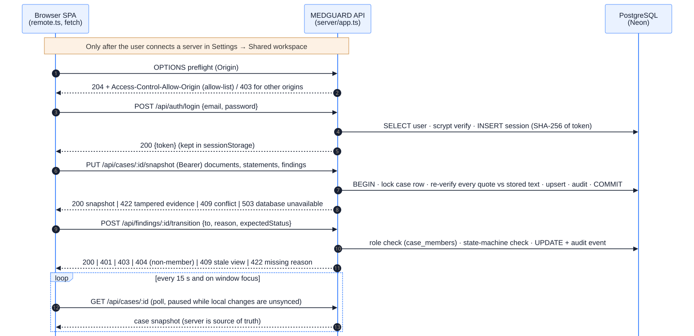{.diagram}

The browser talks to the API only after a user connects a server URL in Settings. Every call is HTTPS JSON with a Bearer token. CORS allows only listed origins. The server re-checks evidence before storing it and enforces the review state machine and roles. The browser polls every 15 s (on window focus too), pausing while local changes are unsynced.

:::

## Diagram 3 · Data storage and persistence

{.diagram}

Two persistence layers share one data model (`src/lib/types.ts`). **Local mode** keeps six Dexie tables in IndexedDB. **Shared mode** keeps ten PostgreSQL tables created by versioned migrations; audit rows cannot be updated, deleted or truncated (database triggers). Snapshot sync *merges*: deletions only happen when explicitly listed, so a stale client cannot erase another reviewer's data.

::: {.landscape}
## Diagram 4 · Deployment and CI/CD

{.diagram}

Every push runs the **test** and **docker-api** jobs. On the default branch the build is published to GitHub Pages and immediately re-tested against the live URL (**verify-production**). The API is deployed by Render from `render.yaml` and the Dockerfile, with `/api/ready` as its health check. A separate **Verify live deployment** workflow exercises the live API and frontend together. Vercel is connected to the repository outside the code, but its deployments are not public.

:::

## Diagram 5 · Security and trust boundaries

{.diagram .narrow}

There are four trust boundaries:

1. **The browser.** Documents are untrusted, rendered only as text under a strict Content-Security-Policy.
2. **The API.** CORS, authentication, per-request authorization, validation and evidence re-verification.
3. **The database.** Verified TLS, parameterised SQL, append-only audit.
4. **The optional AI provider.** Currently off. It would receive document text only after explicit consent, and its output is never trusted without quote verification.

Secrets live only in the hosting dashboard.

# Part 14 · Complete user workflow {#workflow}

{.diagram .narrow}

| # | Step | Status | Notes |
|---|---|---|---|
| 1 | User opens the website | A | Local demo mode; demo workspace seeded (6 synthetic cases, 16 records) |
| 2 | Interacts with the interface | A | Overview, Cases, Case workspace, Contradictions, Finding detail, Documents, Review Queue, Activity, Settings, Help; Ctrl/Cmd+K search |
| 3 | Uploads input | A | PDF, scanned PDF, PNG/JPEG, TXT, DOCX |
| 4 | Frontend validation | A | Type, magic bytes, size, empty, duplicate |
| 5 | Request sent to backend | A (shared mode only) | Snapshot push after local analysis; file upload route |
| 6 | Backend validates | A | zod, size limits, ID patterns, evidence re-verification |
| 7 | Authentication / authorization | A | Bearer session; per-case role |
| 8 | Data processed | A | In the browser (extraction, OCR, rules) |
| 9 | Contradiction logic runs | A | `detectContradictions()` in the browser; optional AI on the server (B) |
| 10 | Findings generated | A | With fingerprint, evidence, type, priority |
| 11 | Findings returned | A | Local: immediately; shared: via snapshot/poll |
| 12 | User reviews results | A | Evidence comparison, View in source, OCR comparison |
| 13 | Follow-up actions | A | Decision + reason, notes, export, backup/restore, share case (owner) |
| 14 | Data persisted | A | IndexedDB / PostgreSQL |
| 15 | Audit events recorded | A | Append-only |
| 16 | Errors handled | A | See below |

::: {.landscape}
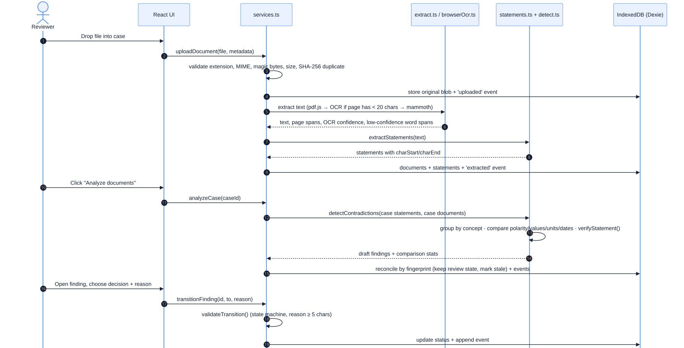{.diagram}
:::

{.diagram .narrow}

::: {.landscape}
{.diagram}
:::

## What happens when…

| Situation | Actual behaviour (implemented) |
|---|---|
| **Input is invalid** | Upload rejected with a specific message (wrong type, not a real PDF/PNG/JPEG, empty, too large, duplicate). API: malformed JSON or schema failure → 400 with a readable message. |
| **Backend is unavailable** | Local mode is unaffected (default). Shared mode: the client waits up to 90 s for a sleeping free instance and says so. A failed push marks the case *unsynced changes* with **Retry sync**, and polling pauses so local work is not overwritten. |
| **Database is unavailable** | The API returns 503 `database_unavailable`; `/api/ready` reports it, and Render's health check uses it. |
| **Request times out** | Client fetches use `AbortController` timeouts. AI requests time out at 120 s (504) and leave the deterministic findings unaffected. |
| **No contradiction is found** | "No potential contradictions were detected by the available rules." Deliberately *not* "no contradictions exist". |
| **A potential contradiction is found** | A classified finding with verified quotes; status *unreviewed*; priority label. |
| **Input cannot be interpreted confidently** | Blank scans or failed extraction: *Needs attention* / *Failed*. A low-confidence OCR word in the evidence makes the finding *insufficient evidence*. A unit without a readable number: "unable to determine the value reliably" (never guessed). |
| **Unauthorized access attempt** | No token → 401. Non-member → 404 (indistinguishable from not found). Insufficient role → 403. Archived case write → 409. |
| **Service temporarily unavailable** | 503 with a readable message; AI not configured → 503 `not_configured`, while the rules analysis continues. |

**Proposed improvements (D):** server-side retry queues, user-visible status page, alerting on 5xx rates.

## Real application screenshots

The screenshots below are from `docs/technical/screenshots/`, captured from the running application with synthetic data on 9 Oct 2026, before the final branding pass.

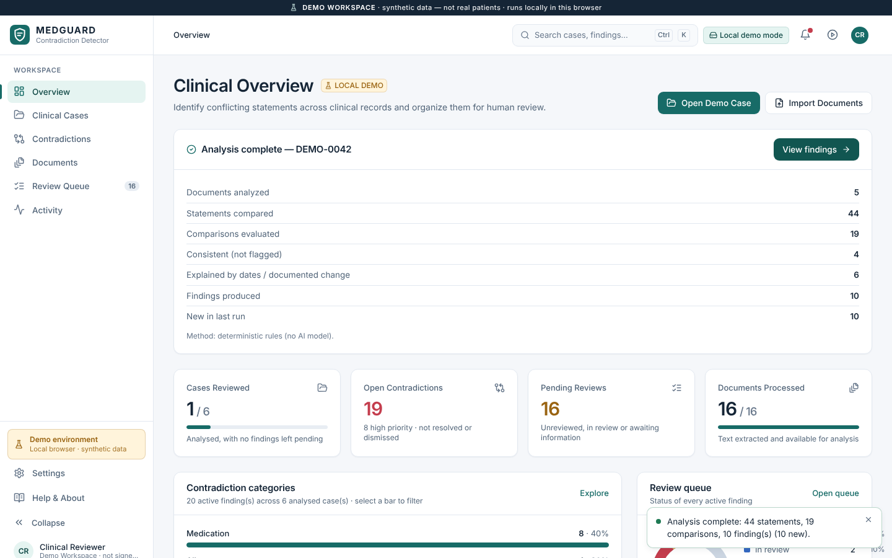{.shot}

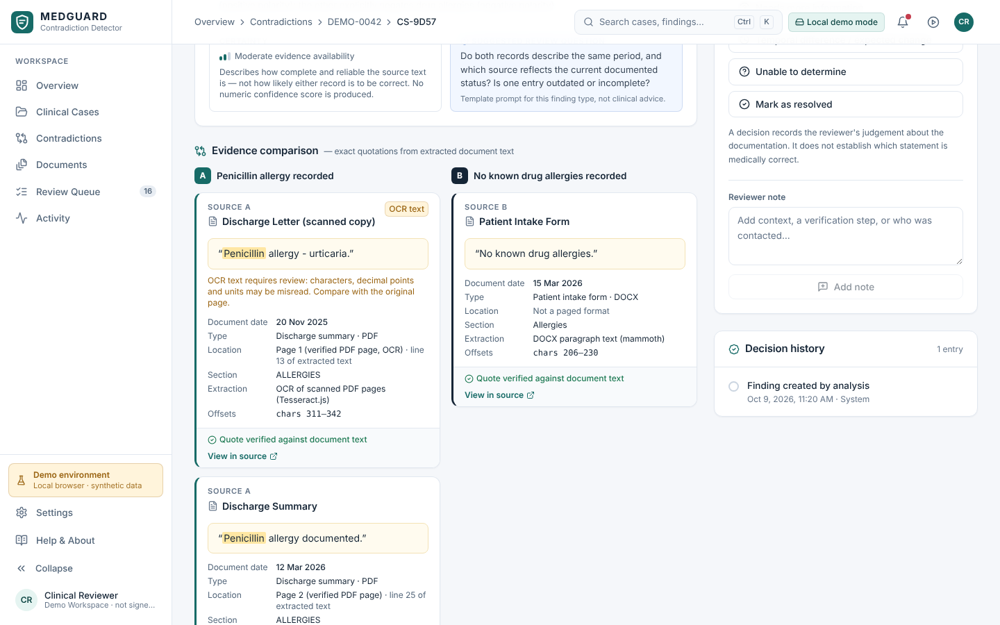{.shot}

# Part 15 · Privacy, security, ethics and medical safety {#safety}

## Data handling facts

| Question | Answer | Status |
|---|---|---|
| What information is accepted? | Clinical documents (PDF, scans, images, TXT, DOCX) and metadata; in shared mode, account email, display name and password | A |
| What is stored? | Originals, extracted text, page spans, OCR provenance, statements, findings, decisions, notes, events; accounts (hashed passwords), session hashes | A |
| Where? | Local: browser IndexedDB on the user's device. Shared: Neon PostgreSQL (originals in `document_files`) | A |
| Access control? | Local: whoever uses that browser profile. Shared: authenticated members with owner/reviewer/viewer roles | A |
| Workspace isolation? | Per-case membership checks on every request; logical, not physical | A |
| Logs? | Method, path, status and duration per request; error names; AI call counts. No document contents | A |
| Do uploads persist? | Yes, until deleted (local) or indefinitely (shared; documents can be removed via sync, cases only archived) | A |
| Retention? | No defined retention period | **Gap** |
| Deletion? | Local: delete documents/cases, reset demo, clear site data. Shared: document removal via snapshot; no case/account delete route | C |
| Encryption? | In transit: HTTPS and verified TLS to the database. At rest: provider defaults only (not verified); no application-level encryption | C |
| Secrets? | Render dashboard env vars; never in the repo or `VITE_*` | A |
| Third parties receiving data? | Hosting providers (GitHub Pages for static files, Render, Neon) in shared mode. Anthropic **only** if AI is enabled and the user consents; it is **not** enabled live | A |

::: {.callout .warn}
**Compliance.** MEDGUARD makes **no** claim of HIPAA, GDPR, India's Digital Personal Data Protection Act 2023, ABDM or any other formal compliance. Technical controls (hashing, roles, TLS, audit) are **not** compliance. The README states: "Use fictional demonstration data only: not for clinical use."
:::

**Before any real patient data:**

* A data protection impact assessment and a lawful basis for processing.
* Data processing agreements with every host.
* Region selection (data residency).
* Encryption at rest that has been verified.
* MFA/SSO.
* Retention and deletion procedures.
* Backups and incident response.
* Penetration testing.
* Fixing the dependency advisories.
* Approval from the organisation's governance and ethics bodies.

## Risk register (healthcare-specific)

| Risk | Relevance to MEDGUARD | Current mitigation | Gap / next step |
|---|---|---|---|
| Sensitive data exposure | Shared mode stores clinical text | Roles, hashed sessions, TLS, no content in logs, CSP | Encryption at rest verification, MFA, retention |
| Unauthorized access | Bearer tokens | Expiry 8 h, login rate limit, 404 for non-members | Token in `sessionStorage` is exposed to XSS (CSP mitigates); add MFA |
| Cross-tenant leakage | Many cases on one database | Membership check on every route; live isolation tests passed | No organisation-level tenancy or row-level security |
| Prompt injection | Only if AI is enabled; document text goes to the model | Model output is untrusted: schema-checked; quotes must exist verbatim; findings start unreviewed | Injected text could still make the model *omit* or *propose* items; a reviewer is always required |
| Malicious uploads | Untrusted files | Magic-byte checks, size limits, pdf.js with `isEvalSupported: false`, text-only rendering, CSP | Parser vulnerabilities in dependencies (mammoth advisory) |
| Hallucination | Only in the optional AI layer | Verbatim-quote requirement; quote text taken from the source; "AI-generated interpretation, not evidence" label | AI explanations can still be wrong |
| Incorrect flags (false positives) | Rules can mis-assign negation or context | Five-type classification, priority, reasons required to dismiss | Not measured |
| Missed contradictions (false negatives) | Anything outside the vocabulary or patterns | "No *potential* contradictions detected **by the available rules**" wording | Not measured; vocabulary limited |
| Outdated information | Older document wins or loses by date | Document dates shown; temporal classification; date-gap caveats | Document dates are user-entered metadata |
| Bias | Vocabulary and English-only OCR favour certain document styles | — | Evaluate across document sources and languages |
| Lack of context | Rules see sentences, not the patient | Alternative explanations listed; "cannot determine which is correct" | Inherent |
| Over-reliance | Users might treat "no findings" as "all clear" | Explicit wording; review required | Training, UI warnings |
| Accountability | Who decided what? | Actor, timestamp, reason in an append-only log | No e-signature; audit not tamper-evident |

## How a reviewer should handle an uncertain finding

1. Read both quotes in context (**View in source**; for scans, **Compare OCR text with original**).
2. Check dates: is one document older or describing a past state?
3. If unclear, choose **Needs more information** (local mode) and record what must be checked.
4. Verify against the primary source: the patient, the pharmacy record, the prescriber or the original document.
5. Record the decision with a reason. Never correct a record based on MEDGUARD alone.

# Part 16 · Technical limitations and failure modes {#limitations}

| Limitation | Failure mode | Impact | How detected | Mitigation | Evidence of improvement |
|---|---|---|---|---|---|
| Fixed vocabulary (26/14/12/10/7) | Drug or condition not in lists is ignored | Missed contradictions | Recall measurement on labelled set | Map to RxNorm/SNOMED/LOINC; verified AI suggestions | Recall ↑ on held-out set |
| Ambiguous wording | "Patient states allergic?" misread | False positive/negative | Error analysis | More hedging patterns; insufficient-evidence fallback | Precision ↑ |
| Negation | Negation beyond a 40-character window or after the term | Wrong polarity | Unit tests with negation corpus | Dependency-aware negation (e.g. NegEx-style rules) | Negation test pass rate |
| Dates and chronology | Missing document dates; DD/MM vs MM/DD ambiguity deliberately unparsed | Temporal findings misclassified | Date-coverage stats | Require document dates; structured date entry | Fewer temporal errors |
| Units | Only mg/g/mcg normalised for doses; labs in different units not converted | Lab comparisons marked "cannot compare" | Lab unit tests | UCUM unit conversion | Conversion coverage |
| Patient context | Rules don't know clinical intent | Context-dependent differences flagged | Reviewer dismiss reasons | Context cues; reviewer feedback loop | Dismiss-rate ↓ |
| Conflicting sources | Two trustworthy sources disagree | Correctly flagged but unresolvable | — | "Undetermined" outcome; escalation | — |
| Incomplete records | Missing documents | Silent false negatives | — | Coverage indicators per case | — |
| OCR errors | Misread digits or decimal points | Wrong values | Low-confidence spans | Confidence downgrade (implemented); original-page comparison | OCR character error rate on labelled scans |
| Document formatting | Multi-column/tabular PDFs lose line order | Mis-grouped statements | Test PDFs | Layout-aware extraction | — |
| Unsupported languages | English-only OCR and vocabulary | No detection | — | Multilingual models/lexicons | — |
| Missing confidence calibration | Evidence-quality labels are not probabilities | Users may over-interpret | — | Keep labels qualitative; calibrate if scores added | Calibration curve |
| No external evidence | Doesn't check guidelines or drug databases | Can't judge correctness | — | Out of scope by design | — |
| Limited evaluation data | Synthetic only | Unknown real-world performance | — | Expert-labelled dataset | Published metrics |
| Concurrent load | Not benchmarked | Unknown capacity | Load testing | Paid tier, replicas, pool tuning | Documented limits |
| External API dependence | AI provider latency/outage/cost | AI unavailable | 503/504 codes | Rules remain the default | — |
| Database availability | Neon scale-to-zero/suspension | 503 | `/api/ready` | Paid plan, monitoring | Uptime % |
| Cold starts | Free Render instance sleeps after 15 min | 20–60 s first request | Timing | Always-on instance | — |
| Limited monitoring | Logs only | Silent failures | — | Metrics, alerts | — |
| No clinical validation | — | Cannot claim usefulness | — | Expert evaluation, pilot | Study results |
| No compliance assessment | — | Cannot process real data | — | Formal assessments | Signed assessments |

# Part 17 · Performance and evaluation {#evaluation}

## What has actually been measured

| Area | Evidence |
|---|---|
| Unit/integration tests | 106/106 pass (local), CI pass |
| Database tests | Pass on PGlite and PostgreSQL 16 (CI); append-only triggers tested in CI |
| API tests | Live API checks all pass (run 37953941921) |
| Browser tests | 25/25 local; live suite pass in CI; 3/3 live two-user tests |
| Build reliability | CI and deploy run 66 succeeded (all 4 jobs) |
| Persistence | Read-back after the live run; earlier documented cold-restart check |
| Security checks | Live CORS, auth, isolation, error-message checks; `npm audit` shows 20 open advisories |
| Response latency | Single observations only (health 168 ms; snapshot 10.5 s). **Not benchmarked** |
| Detection accuracy, precision, recall, false-positive/negative rates, robustness to ambiguity | **NOT MEASURED** |

::: {.callout .warn}
**Passing tests do not measure accuracy.** The tests check that the engine produces the expected findings for the synthetic cases it was written against, for example the 10 expected findings in DEMO-0042 and the per-case findings in `tests/unit/workspace.test.ts`. That is regression testing, not evaluation.
:::

## Proposed evaluation plan (future work)

1. **Dataset:** 200+ synthetic-realistic cases written or reviewed by at least two clinicians or pharmacists. Include:
   * contradictions of every type, plus **non-contradictions** (documented changes, different specimen dates, historical allergies);
   * ambiguous items;
   * all supported formats, including scanned copies with controlled degradation.
2. **Labels:** each pair of statements labelled contradiction / not / uncertain, with type. Measure **inter-reviewer agreement** (Cohen's κ).
3. **Metrics:**
   * precision, recall and F1 overall and per category;
   * false-positive and false-negative analysis with error taxonomy;
   * OCR character and word error rate on labelled scans;
   * percentage of findings with verifiable evidence (should be 100 % by construction).
4. **Calibration:** if numeric scores are introduced, reliability diagrams. Currently there are none.
5. **Latency and reliability:** time per document and per case in the browser on representative devices; API load test with documented limits.
6. **Usability:**
   * task-based sessions with 5–8 reviewers;
   * median time to review a finding;
   * System Usability Scale;
   * review-completion rate.
7. **Comparative arm:** manual review vs MEDGUARD-assisted review on the same cases: time taken and discrepancies found.
8. **Reporting:** publish the dataset description, metrics and failure examples, and mark the version of rules evaluated (`DETECTION_METHOD` string).

# Part 18 · 100 hackathon judge questions with answers {#questions}

**How to use this section.**

* **Say it** is the 20–60 second spoken answer to memorise.
* **Detail** is the technical depth to add if the judge is technical.
* **Evidence** points to proof.
* **Careful** marks a limitation you must state.
* **If pressed** is your follow-up for hard questions.

Evidence markers: [Code], [Test], [Live], [Ext], [Inference], [Unknown].

::: {.qindex}
**Categories:**

1. Project fundamentals: Q1–Q10
2. Problem and solution: Q11–Q20
3. Stack and architecture: Q21–Q30
4. AI, NLP and detection: Q31–Q40
5. Database, security and privacy: Q41–Q50
6. Uniqueness and competitors: Q51–Q60
7. Feasibility and scalability: Q61–Q70
8. Business and viability: Q71–Q80
9. Controversial and adversarial: Q81–Q90
10. Difficult and future-looking: Q91–Q100
:::

## Question index {#question-index}

Page numbers link to each question.

::: {#qindex-list}
:::

## Category 1 · Project fundamentals {#cat1}

### Q1. What is MEDGUARD? {.q}
**Say it:** "MEDGUARD is a healthcare record contradiction detector. You give it a patient's documents, digital or scanned. It finds statements that disagree across them, like an allergy in one record and 'no known drug allergies' in another, and shows the exact quote behind every flag so a reviewer can check it and record a decision."

**Detail:** React/TypeScript single-page app. Extraction (pdf.js, Tesseract.js OCR, mammoth), deterministic rule-based statement extraction and cross-document comparison all run in the browser. An optional Node/PostgreSQL API adds shared multi-user cases.

**Evidence:** Live site and API verified 9 Oct 2026 [Live]; `src/lib/detect.ts` [Code].

### Q2. What problem does it solve? {.q}
**Say it:** "The same clinical fact is written in many documents, and the copies drift apart. Finding the disagreements means reading everything side by side. MEDGUARD makes the disagreements visible and traceable."

**Detail:** It targets *detection and traceability*, not clinical adjudication.

**Careful:** We have not measured how often these contradictions occur in real records.

### Q3. Who needs it? {.q}
**Say it:** "People who reconcile records: pharmacists doing medication reconciliation, clinicians at admission and discharge, clinical documentation and quality reviewers."

**Detail:** These are *intended* users. We haven't run user interviews yet; that is the first validation step.

**Evidence:** Problem analysis, Part 6 [Inference].

### Q4. Why did you build it? {.q}
**Say it:** "PS-11R3 asked for a healthcare record contradiction detector. We felt that a flag without evidence is useless in healthcare, so we built the whole system around verifiable evidence and human decisions."

**Detail:** Design principle in code: no finding is created unless every quote re-matches its source offsets (`verifyStatement`).

### Q5. What is the main objective? {.q}
**Say it:** "Turn scattered, possibly conflicting records into a short, evidence-backed list of things a human should check, and keep a record of what they decided."

### Q6. What is the primary use case? {.q}
**Say it:** "Medication and allergy reconciliation across a case. For example, a drug listed as stopped in the discharge summary but active in the medication list, or an allergy documented in one place and denied in another."

**Evidence:** Demo case DEMO-0042 produces 10 findings including the penicillin/NKDA conflict and aspirin discontinued-vs-active [Test] (`tests/unit`).

### Q7. What is the input and output? {.q}
**Say it:** "Input: PDF, scanned PDF, PNG or JPEG, Word or text documents grouped into a case. Output: classified findings with the exact quotes, document, date and page, plus a review workflow, history and exports."

**Detail:** Five finding types. Exports are a JSON report, a findings CSV and a full backup.

### Q8. What is the core user benefit? {.q}
**Say it:** "You don't have to trust us. Every flag shows where it came from, and you can click through to the highlighted passage in the original."

**Careful:** Time saved has not been measured.

### Q9. What is the current project status? {.q}
**Say it:** "Working prototype, live. The browser app is on GitHub Pages; the optional shared workspace runs on Render with PostgreSQL on Neon. Both were verified today by automated live checks. 106 unit and integration tests and 25 browser tests pass. It is not clinically validated and uses synthetic data only."

**Evidence:** Actions runs 37953179435 and 37953941921; local test run [Live][Test].

### Q10. What is the biggest current limitation? {.q}
**Say it:** "We don't know its accuracy on real records. The rules cover a fixed vocabulary of about 26 drugs, 14 allergens, 12 diagnoses, 10 labs and 7 procedures, and we haven't measured precision or recall with expert-labelled data."

**If pressed:** "That's exactly why every finding carries evidence and needs a human decision. The design assumes the engine can be wrong."

## Category 2 · Problem statement and solution {#cat2}

### Q11. Why is the problem important? {.q}
**Say it:** "Medication and allergy information that's wrong or inconsistent at care transitions is a recognised safety issue. Medication reconciliation is a Joint Commission National Patient Safety Goal, and studies report that medication history errors at admission are common."

**Evidence:** S1 (Joint Commission NPSG.03.06.01) and S2 (Tam et al., *CMAJ* 2005) [Ext].

**Careful:** Quote S2's numbers only after checking the paper. We have not measured prevalence ourselves.

### Q12. How do users address it today? {.q}
**Say it:** "Mostly manually. They read the documents side by side, sometimes with medication-history services or EHR reconciliation screens. That's our understanding; we haven't observed it directly yet."

**Detail:** Products like DrFirst MedHx bring in external medication history; EHRs have reconciliation workflows [Ext].

### Q13. Why is a software solution appropriate? {.q}
**Say it:** "Comparing many statements across many pages is repetitive and well suited to a computer. Deciding what's true is not, so we automate the comparison and leave the judgement to people."

### Q14. Which part of the problem do you address? {.q}
**Say it:** "Finding possible disagreements, showing the evidence, and recording the reviewer's decision. Not deciding which statement is correct, and not updating the source EHR."

### Q15. What happens when no contradiction is found? {.q}
**Say it:** "It says 'No potential contradictions were detected by the available rules', deliberately not 'no contradictions exist'. The rules only cover what they know."

**Evidence:** README and UI text [Code].

### Q16. What happens when evidence is incomplete? {.q}
**Say it:** "It becomes an 'insufficient evidence' finding, for example an unverified 'possible sulfa reaction', or a dose that's unreadable on a scan. The value is never guessed."

**Detail:** A finding that relies on an OCR word below 70 % confidence is downgraded automatically; a unit without a readable number gives "unable to determine the value reliably".

### Q17. What's the difference between an inconsistency and a medical error? {.q}
**Say it:** "An inconsistency means two records disagree. A medical error means something is clinically wrong. A dose change can be intentional, and an allergy can be de-labelled after testing. We flag the disagreement; a professional decides whether it's an error."

### Q18. Who benefits most? {.q}
**Say it:** "Reviewers handling many mixed-format documents per patient, such as reconciliation pharmacists and documentation-quality teams. Indirectly, patients, if discrepancies are caught earlier. That benefit isn't proven yet."

### Q19. What assumptions does the project make? {.q}
**Say it:** "That cross-document contradictions are common enough to matter, that reviewers will trust evidence-backed flags, and that our precision is high enough to save time rather than add it. All three need testing."

### Q20. How would you validate that the problem is real? {.q}
**Say it:** "Interview and observe five to ten reconciliation pharmacists and documentation reviewers, measure how long cross-checking takes, and count how many discrepancies they find in a sample of de-identified cases."

**Detail:** Combine with the evaluation plan in Part 17.

## Category 3 · Technical stack and architecture {#cat3}

### Q21. Why React for the frontend? {.q}
**Say it:** "React 18 with TypeScript gives us a mature component model and strong typing. Combined with Vite it builds to a static site that runs anywhere, including GitHub Pages, with no server."

**Detail:** HashRouter keeps routes working under any sub-path. Tailwind and CSS variables provide the design tokens.

### Q22. Why that backend framework? {.q}
**Say it:** "We deliberately used no framework, just Node 22's built-in `http` module with a small router and zod validation. It keeps dependencies minimal, the whole server bundles into one file, and the shared review logic is the same TypeScript the browser uses."

**Evidence:** `server/app.ts`, `npm run server:build` [Code]. Docker image built in CI [Test].

**Careful:** Express or Fastify would add middleware conventions; we traded those for control and a tiny footprint.

### Q23. Why PostgreSQL? {.q}
**Say it:** "Real constraints, transactions, row locks and triggers. Our audit log is append-only at the database level, which PostgreSQL triggers enforce. It also runs embedded through PGlite for local development and tests, and on a free managed host, Neon, for the live deployment."

**Evidence:** `server/db.ts` migrations v1–v3; live `/api/ready` reports `engine: postgresql` [Live].

### Q24. How does the frontend communicate with the backend? {.q}
**Say it:** "HTTPS JSON with `fetch` and a Bearer token, only after the user connects a server in Settings. The browser pushes case snapshots and review actions, and polls every 15 seconds for changes from other reviewers."

**Detail:** CORS allow-list; 30–90 s timeouts with `AbortController`. Optimistic concurrency returns 409 on stale views.

### Q25. What happens during a request? {.q}
**Say it:** "CORS check, route match, token lookup by SHA-256 hash, role check for the case, zod validation, then a transaction that does the work and writes an audit event. Errors map to clear HTTP codes, with no stack traces."

**Evidence:** `server/app.ts` request handler [Code]; live error-handling checks [Live].

### Q26. Where is the core detection logic? {.q}
**Say it:** "In the browser: `src/lib/statements.ts` extracts statements, `lexicon.ts` holds the vocabulary, `detect.ts` compares and classifies. The server re-verifies the evidence quotes but doesn't need to re-run detection."

### Q27. How is data persisted? {.q}
**Say it:** "Locally in IndexedDB through Dexie, with six tables including original files. In shared mode, in PostgreSQL: ten tables including original files as BYTEA and an append-only audit table."

### Q28. How does deployment work? {.q}
**Say it:** "Every push to the default branch runs tests, builds, publishes the static site to GitHub Pages and re-runs the end-to-end tests against the live URL. The API is a Docker image deployed by Render from a blueprint, with a Neon PostgreSQL connection string stored as a secret."

**Evidence:** CI run 66 (all four jobs passed) [Live].

### Q29. How do automated tests run? {.q}
**Say it:** "GitHub Actions on every push: type-check, 106 Vitest tests including real OCR and API tests, the API and database tests again on a real PostgreSQL 16 container, a production build, 25 Playwright browser tests, a Docker persistence test and, after deploy, the e2e suite against the live site."

### Q30. What would you change at larger scale? {.q}
**Say it:** "Always-on paid API instances co-located with the database, object storage for files, a background job queue for OCR and AI, a shared rate limiter, incremental sync instead of full snapshots, organisation-level tenancy, and monitoring with alerts."

## Category 4 · AI, NLP and contradiction detection {#cat4}

### Q31. Is the project actually using AI? {.q}
**Say it:** "The core detection is not AI; it's deterministic rules, which is a deliberate choice for transparency. We use Tesseract's neural OCR to read scans. There is an optional LLM layer through the Anthropic API, but it's off in our live deployment and has only been tested against a stand-in provider."

**Careful:** Never call MEDGUARD "AI-powered detection". Say "rule-based detection with optional, evidence-checked AI assistance".

### Q32. Rule-based, ML-based, LLM-based or hybrid? {.q}
**Say it:** "Rule-based by default. Hybrid only if a server with an AI key is connected; then LLM suggestions are added, but only after they pass the same evidence check as the rules."

### Q33. How is a contradiction defined? {.q}
**Say it:** "Two or more statements about the same normalised concept in the same case that can't both be true as written: opposite polarity, different values for the same thing, or a status mismatch. Each is then classified: explicit conflict, potential discrepancy, temporal inconsistency, historical or contextual difference, or insufficient evidence."

### Q34. How are negations handled? {.q}
**Say it:** "Pattern rules look up to 40 characters before a term for cues like 'no', 'denies', 'negative for', 'ruled out' or 'never'. So 'No history of kidney disease' is a negative statement, and it conflicts with 'Chronic kidney disease' elsewhere."

**Careful:** Negation after a term, or across long sentences, can be missed.

### Q35. How are units and dates handled? {.q}
**Say it:** "Doses are normalised to milligrams (1 g = 1000 mg, mcg divided by 1000), so they compare correctly. Lab values are only compared for the same specimen date; different dates are expected to differ. Ambiguous numeric dates like 03/07 are deliberately not parsed."

### Q36. How is context preserved? {.q}
**Say it:** "Each statement keeps its document, date, section, page and exact offsets. Rules recognise history ('as a child', 'resolved'), hedging ('possible, not verified'), family history (excluded) and documented changes ('increased from 10 mg'), which turns a dose difference into a contextual finding instead of a conflict."

### Q37. How are false positives handled? {.q}
**Say it:** "In design: temporal and contextual rules avoid common false alarms; findings carry priority labels; and a reviewer can dismiss with a mandatory reason, which is recorded. In measurement: we haven't measured the false-positive rate yet."

### Q38. How are false negatives handled? {.q}
**Say it:** "Honestly, that's the weaker side of a rule engine: anything outside the vocabulary is missed. We word the output carefully ('detected by the available rules'), and the optional verified-AI layer is meant to widen coverage. Recall isn't measured yet."

### Q39. How is evidence presented? {.q}
**Say it:** "Side A versus side B. Each side shows the verbatim quote, document title, date, page and section, extraction method, character offsets and 'Quote verified against document text'. 'View in source' highlights the passage; for scans you can compare the OCR text with the original page image."

**Evidence:** Screenshot in Part 14 [Code].

### Q40. How would you evaluate accuracy? {.q}
**Say it:** "A labelled set of a few hundred synthetic-realistic cases reviewed by two clinicians, covering every contradiction type and plenty of non-contradictions. We'd report precision, recall and F1 by category, inter-reviewer agreement and an error analysis, then compare assisted against manual review time."

## Category 5 · Database, security and privacy {#cat5}

### Q41. What information is stored? {.q}
**Say it:** "Documents and their extracted text, statements, findings with evidence, review decisions, notes and an audit trail. In shared mode also accounts, with scrypt-hashed passwords and SHA-256-hashed session tokens."

### Q42. Why PostgreSQL rather than something simpler? {.q}
**Say it:** "We started with SQLite, but free hosts have no persistent disks, so we moved to PostgreSQL. It gives us managed hosting on Neon, the same SQL locally through PGlite, transactions, row locks, constraints, and triggers that make the audit log append-only."

**Evidence:** `docs/backend/DEPLOYMENT.md` "Options considered and rejected"; schema v3 [Code].

### Q43. How does persistence work? {.q}
**Say it:** "Local mode writes everything to IndexedDB in transactions. Shared mode writes to PostgreSQL in transactions that lock the case row. Migrations run at start-up under an advisory lock. Today's live check confirmed data reads back after the run."

### Q44. How are users or workspaces isolated? {.q}
**Say it:** "Every request checks the caller's role in that specific case. Non-members get 404, the same as 'not found', so they can't even tell a case exists. Our live test confirmed an outsider couldn't read, download, change or list another user's case."

**Careful:** This is logical isolation in one database, not separate databases per organisation.

### Q45. How are unauthorised requests handled? {.q}
**Say it:** "No token: 401. Not a member: 404. Wrong role: 403. Archived case: read-only (409). Origins outside the CORS list: 403."

### Q46. How are secrets protected? {.q}
**Say it:** "The database URL and any AI key exist only as environment variables in the Render dashboard. The repository has placeholders only. Nothing secret is in the frontend; anything prefixed `VITE_` is public by design. Health endpoints were checked to expose no secrets."

### Q47. How is uploaded data handled? {.q}
**Say it:** "As untrusted. We check the extension, MIME type, magic bytes, size and duplicates, sanitise filenames, run pdf.js with eval disabled, and render text only, never HTML, under a strict Content-Security-Policy. On the server, files are stored in the database and served only to case members."

### Q48. What security controls exist? {.q}
**Say it:** "Hashed passwords and sessions, session expiry, login rate limiting, per-case roles, CORS allow-list, input validation, parameterised SQL, size limits, TLS to the database, CSP, an append-only audit log and no document contents in logs."

**Careful:** Missing: MFA/SSO, password reset, encryption at rest verification, monitoring, tamper-evident audit. `npm audit` lists 20 open advisories, mostly in development tooling.

### Q49. Is the project formally compliant with relevant regulations? {.q}
**Say it:** "No. We make no HIPAA, GDPR or Indian DPDP Act compliance claims. We have technical controls, but compliance needs formal assessments, agreements and processes we haven't done. That's why we use synthetic data only."

### Q50. What must change before processing real patient data? {.q}
**Say it:** "A privacy impact assessment and legal basis, data processing agreements and data residency with every host, MFA/SSO, verified encryption at rest, retention and deletion rules, backups, monitoring, a penetration test, fixing dependency advisories, and approval from the organisation's governance. Plus an evaluation showing it's accurate enough to be useful."

## Category 6 · Uniqueness and competitors {#cat6}

### Q51. What makes MEDGUARD different? {.q}
**Say it:** "Three things together: every flag is backed by quotes that are mechanically re-verified against the source; contradictions are typed with temporal context, so documented changes aren't treated as conflicts; and every decision needs a reason and goes into an append-only history. It can also run entirely in the browser, OCR included."

### Q52. Are similar products already available? {.q}
**Say it:** "Parts of it, yes. Cloud clinical NLP services like Amazon Comprehend Medical and Microsoft Text Analytics for health extract medications with negation. Record-review platforms like Wisedocs and DigitalOwl summarise records with citations, and DigitalOwl advertises inconsistency highlighting for insurance and legal work. CDI software like Solventum's routes documentation issues to specialists."

**Careful:** Our competitor evidence comes from search-result excerpts; we're careful not to claim what they lack.

### Q53. Who are the closest competitors? {.q}
**Say it:** "DigitalOwl and Wisedocs for multi-document record review with evidence, Solventum's CDI tools for flag-then-human-resolve workflows, and DrFirst MedHx for medication discrepancies, though it works from structured history data rather than documents."

### Q54. Why would users choose MEDGUARD? {.q}
**Say it:** "Transparency and ease of trial. Rules they can inspect, evidence they can verify, a decision trail, and a local mode that needs no data-sharing agreement to try with synthetic or de-identified documents."

**Careful:** That's a hypothesis until we have users.

### Q55. What can established competitors do better? {.q}
**Say it:** "Almost everything at scale: validated accuracy, broad medical terminology, EHR integration, security certifications, support and procurement readiness. We'd be foolish to claim otherwise."

### Q56. Is the idea genuinely new? {.q}
**Say it:** "Checking records for consistency isn't new. What we haven't seen documented is this specific combination: deterministic cross-document contradiction types, offset-verified evidence for every flag, mandatory-reason review and a fully local mode. We don't claim to be first."

### Q57. What is the defensible advantage? {.q}
**Say it:** "Today, an evidence-first architecture and the trust that comes with it. Long term, defensibility would come from an expert-labelled evaluation dataset, clinical partnerships and integration, which we don't have yet."

### Q58. What would stop competitors copying it? {.q}
**Say it:** "Nothing technical, honestly. The code is MIT-licensed. Defensibility would have to come from data, validation, domain partnerships and execution speed, not secrecy."

### Q59. What is the strongest differentiator? {.q}
**Say it:** "Verified evidence: a finding cannot exist unless its quotes exactly match the source text at the stored positions. The same rule applies to AI suggestions, so a model can't invent evidence."

**Evidence:** `verifyStatement()`, `verifyAiOutput()` [Code]; server re-verification returned 422 for tampered evidence in tests [Test].

### Q60. Which feature would most improve competitiveness? {.q}
**Say it:** "Measured accuracy, meaning an expert-labelled evaluation. After that, mapping to standard terminologies like RxNorm and SNOMED to widen coverage, and FHIR integration so it fits into existing systems."

## Category 7 · Feasibility and scalability {#cat7}

### Q61. Can it work outside a demo? {.q}
**Say it:** "Technically yes: it's deployed, with real accounts, a real database and live checks passing. Clinically we don't know yet. That depends on accuracy on real records, which we haven't measured."

### Q62. What are the main deployment constraints? {.q}
**Say it:** "Free tiers. The API sleeps after 15 idle minutes, so the first request can take 20 to 60 seconds; there's no SLA; and storage is small. The API and database also weren't in the same region, which added latency per database round trip."

**Evidence:** `docs/backend/DEPLOYMENT.md`; 10.5 s snapshot in today's run [Live].

### Q63. Can it support more users? {.q}
**Say it:** "The architecture can scale: the browser does the heavy processing, the API is stateless apart from in-memory rate limits, and PostgreSQL scales. But we haven't load-tested, so we won't quote a number."

### Q64. What will be the first bottleneck? {.q}
**Say it:** "Probably the free single API instance and its 5-connection database pool, plus large case snapshots on every sync. On the client side, OCR of many scanned pages on a slow laptop."

**Careful:** That's an inference, not a measurement.

### Q65. What happens when the database grows? {.q}
**Say it:** "Queries are indexed by case, so per-case cost stays bounded. Storage is the issue, because original files sit in the database. We'd move files to object storage and keep metadata in PostgreSQL."

### Q66. What happens when requests increase? {.q}
**Say it:** "Add API replicas behind a load balancer, use Neon's pooled endpoint, move the rate limiter to shared storage, and switch sync from full snapshots to incremental changes."

### Q67. How could processing move to background workers? {.q}
**Say it:** "Uploads would enqueue a job, for example in a PostgreSQL-backed queue; workers would run OCR, extraction and detection with the same TypeScript engine, write results and notify the client. The engine is plain TypeScript, so it runs in Node as well, and the tests already run it there."

### Q68. How would availability improve? {.q}
**Say it:** "Paid always-on instances, API and database in the same region, automated backups with point-in-time recovery, health-check-based restarts, uptime monitoring and alerting."

### Q69. How should load testing be done? {.q}
**Say it:** "Scripted scenarios with a tool like k6: login, sync a case of N documents, review actions, polling from M concurrent reviewers, ramped until latency or errors breach targets, run against a staging copy with the same plan. Then publish the limits."

### Q70. What must be done before a production pilot? {.q}
**Say it:** "An expert evaluation, a security review with the dependency advisories fixed, MFA/SSO, retention rules, backups, monitoring, a paid hosting tier, privacy and regulatory assessments, and a pilot protocol in which a human always decides."

## Category 8 · Business model and viability {#cat8}

### Q71. Who pays for the product? {.q}
**Say it:** "Most likely a hospital's pharmacy, quality and patient-safety, or clinical documentation department, not individual clinicians. That's a hypothesis; we haven't talked to buyers yet."

### Q72. What is the value proposition? {.q}
**Say it:** "Find disagreements across a patient's documents in minutes instead of reading everything, with the evidence attached and an audit trail of what was decided."

### Q73. What is the possible revenue model? {.q}
**Say it:** "We'd test a paid pilot with one department first, then a departmental subscription or per-seat licence, with on-premise licensing for hospitals that can't use cloud hosting. None of this exists yet."

### Q74. What are the major operating costs? {.q}
**Say it:** "Today almost nothing: free tiers. At pilot scale, paid hosting and database, storage for files, monitoring, security assessments, support time and, if enabled, AI usage per case."

### Q75. Why would a hospital adopt it? {.q}
**Say it:** "Only if an evaluation shows it saves reviewer time or catches discrepancies people miss, at acceptable false-alarm rates, and it passes their security and privacy review. Until then, it's a research prototype."

### Q76. How would you obtain the first pilot users? {.q}
**Say it:** "Through our institution's clinical contacts and teaching hospitals, offering a free, low-risk evaluation on synthetic or de-identified documents, with the local mode so no data leaves their machines."

### Q77. What is the competition? {.q}
**Say it:** "EHR-native reconciliation tools, CDI platforms such as Solventum's, medication-history services such as DrFirst MedHx, record-review AI such as Wisedocs and DigitalOwl, and of course manual review, which is the real incumbent."

### Q78. How could it be sustained financially? {.q}
**Say it:** "Subscriptions or licences from departments that see measurable benefit, plus academic grants for the evaluation work. The low infrastructure cost helps, but trust and integration are the real costs."

### Q79. What are the adoption barriers? {.q}
**Say it:** "Trust in accuracy, security and privacy review, integration with EHRs, alert fatigue, procurement cycles, and the need for clinical validation."

### Q80. What would demonstrate product–market fit? {.q}
**Say it:** "A pilot department that keeps using it after the trial, that would pay, and measured outcomes: review time down, discrepancies found, and a dismiss rate low enough that flags are trusted."

## Category 9 · Controversial and adversarial questions {#cat9}

### Q81. Why should anyone trust your application with healthcare information? {.q .hard}
**Say it:** "Right now, they shouldn't with real patient data, and we say so in the app. What you can trust is the design: every flag shows its evidence, nothing is decided automatically, every decision is logged, and in local mode nothing leaves your browser. Trust with real data has to be earned through evaluation and security review."

**If pressed:** "Our live deployment's isolation, authentication and audit checks passed today. That's engineering evidence, not clinical approval."

### Q82. What if MEDGUARD misses a dangerous contradiction? {.q .hard}
**Say it:** "It can, especially outside its vocabulary. That's why it's positioned as an aid, not a safety net. 'No findings' never means 'safe', and the UI wording reflects that. Existing clinical processes must stay in place."

**If pressed:** "Reducing misses is the point of the evaluation plan: measure recall per category, then widen coverage with standard terminologies and evidence-checked AI."

### Q83. What if it flags correct information as contradictory? {.q .hard}
**Say it:** "That's a false positive. The reviewer sees both quotes, recognises the context, for example an intentional dose change, and dismisses it with a reason. We designed temporal and contextual rules specifically to reduce these, but we haven't measured the rate."

### Q84. Can your software make a clinician's decision worse? {.q .hard}
**Say it:** "Potentially: through over-reliance, alert fatigue or a misread OCR value. Our mitigations are evidence on every flag, OCR confidence downgrades, no automatic decisions, explicit 'cannot determine which is correct' wording, and 'insufficient evidence' instead of guessing. A clinical evaluation would need to look for exactly these harms."

### Q85. Why should anyone trust a student-built healthcare system? {.q .hard}
**Say it:** "They shouldn't trust it because of who built it. They should judge it by evidence: it's open source, it has 106 unit and integration tests and 25 browser tests, the deployment is verified, and its limitations are documented. For clinical use, it would need the same validation as anyone else's product."

### Q86. Are you exaggerating the role of AI? {.q .hard}
**Say it:** "We try hard not to. The detection is rule-based. AI appears in OCR, and there's an optional LLM layer that's off in the live deployment and has never been run against the real model. If anything, we under-sell AI on purpose."

### Q87. What evidence proves your solution is useful? {.q .hard}
**Say it:** "None yet proves usefulness. We have evidence that it *works* as designed: tests, live checks and correct findings on synthetic cases. Usefulness needs a user study comparing assisted and manual review. That's our next step."

### Q88. How is your project better than an established commercial product? {.q .hard}
**Say it:** "Overall, it isn't. Established products have validation, scale and integration. Where we may be better is narrow: transparency of rules, guaranteed evidence for every flag, a decision trail, and the ability to try it locally at near-zero cost."

### Q89. What happens if the backend goes offline during use? {.q .hard}
**Say it:** "Local mode doesn't use it at all. In shared mode, the app keeps your local work, marks the case 'unsynced changes', pauses background refresh so nothing is overwritten, and offers Retry sync. The server's database transactions mean half-written changes don't persist."

**Evidence:** `sync.test.ts`; review-during-sync regression test [Test].

### Q90. Would you personally approve this system for real patient care today? {.q .hard}
**Say it:** "No. It hasn't been clinically validated, the security work for real data isn't done, and it runs on free hosting. I'd approve a supervised evaluation on de-identified data with ethics approval, and nothing beyond that until results justify it."

## Category 10 · Difficult, unanswerable and future-looking questions {#cat10}

### Q91. What is the exact accuracy of your system? {.q .hard}
**Say it:** "That hasn't been measured in our current implementation. We'd establish it with an expert-labelled set of cases, reporting precision, recall and F1 by category. Until that evaluation is complete, we won't claim an accuracy figure."

**If pressed:** "On our synthetic test cases it produces the expected findings, but those tests were written alongside the rules, so they aren't an accuracy measure."

### Q92. How many real clinical users have validated it? {.q .hard}
**Say it:** "None. No clinician has formally evaluated it. Our first step would be a usability and accuracy study with pharmacists and clinicians. Until then, we won't claim clinical validation."

### Q93. How many hospitals use it? {.q .hard}
**Say it:** "Zero. It's a hackathon prototype with synthetic data. We'd only approach a hospital pilot after evaluation and security review."

### Q94. What is its maximum tested concurrent-user capacity? {.q .hard}
**Say it:** "Not measured. The largest concurrency we've exercised is two simultaneous reviewers in our live browser test. We'd establish real limits with a load test against a staging environment, and until then we won't quote a number."

### Q95. What is its regulatory approval status? {.q .hard}
**Say it:** "It has none, and no regulatory assessment has been done. Whether it would count as a medical device depends on how it's used. As a documentation-consistency aid with no automated decisions it may fall outside, but that needs formal regulatory advice, not our opinion."

### Q96. Can it guarantee zero missed contradictions? {.q .hard}
**Say it:** "No, and no system honestly could. The rules only know their vocabulary and patterns. What we guarantee is narrower: anything it *does* flag has verifiable evidence."

### Q97. Can it guarantee zero false positives? {.q .hard}
**Say it:** "No. Context like intentional changes or de-labelled allergies can produce flags that a reviewer will dismiss. We've designed to reduce them; we haven't measured the rate."

### Q98. What happens when two trustworthy sources disagree? {.q .hard}
**Say it:** "MEDGUARD shows both, with dates and context, and doesn't pick a winner. The reviewer can record 'unable to determine' or 'needs more information' and escalate, for example by asking the patient or prescriber. The disagreement itself is the useful output."

### Q99. What will the system look like in five years? {.q .hard}
**Say it:** "If evaluation supports it: integrated with EHRs through FHIR, using standard terminologies, combining rules with evidence-checked language models, validated on real data, and deployed in hospitals with proper security and governance. If evaluation doesn't support it, it stays a teaching and research tool. Both outcomes are fine."

### Q100. What is the single biggest unresolved risk? {.q .hard}
**Say it:** "That it isn't accurate enough on real records to save time, so reviewers drown in false alarms or miss what matters. Everything else, such as security, scale and hosting, is solvable engineering. Accuracy and usefulness have to be proven, and we haven't proven them yet."

# Part 19 · Answer quality rules (for live Q&A) {#answer-rules}

* **Lead with the honest one-liner,** then add detail.
* **Separate the evidence types** out loud: "In the code…", "Our live check today showed…", "Published research suggests…", "We haven't measured…".
* **Never say:** "AI-powered detection", "accurate", "validated", "production-ready", "HIPAA-compliant", "guarantees", "eliminates errors", "replaces clinicians".
* **Use the unknown-answer formula:** "That has not yet been measured in our current implementation. We would establish it through [specific method]. Until that is complete, we would not claim [result]."
* **When challenged, agree with the valid part first,** then state what you *can* show.

# Part 20 · Project demonstration script {#demo}

::: {.callout .note}
**Before presenting:**

1. Open the live site once while online and wait about 30 seconds, so the offline cache and the ~7 MB of OCR data load.
2. **Settings → Reset Demonstration** (rebuilds only the six synthetic cases).
3. Keep a local build ready (`npm run build && npm run preview`) in case the network fails.
4. Do **not** demo the shared workspace unless the API was woken a few minutes earlier (free tier sleeps).
5. Do **not** demo AI: it is not configured.

Synthetic data only.
:::

## A · 30-second introduction
"Hi, we're presenting MEDGUARD for PS-11R3. Patient records disagree with each other, and finding where is slow. MEDGUARD flags *possible* contradictions across a patient's documents, shows the exact source quote for each, and leaves the decision to a human. Everything you'll see is live and uses synthetic data."

## B · 60-second problem explanation
"A patient's allergies, medications and diagnoses are written into discharge summaries, intake forms, medication lists, lab reports and scanned letters by different people at different times. Copies drift. One record says penicillin allergy, another says no known drug allergies; a drug is stopped in one and active in the next. Medication reconciliation at care transitions is a recognised safety practice, but comparing documents by hand is tedious, scanned pages can't be searched, and even when you find a disagreement you need to show where each version came from and record what you decided. We focus on exactly that: detection plus traceability, not diagnosis."

## C · 2-minute product demonstration

| Step | What to click / input | What to show | Concept | Say | What could go wrong → backup |
|---|---|---|---|---|---|
| 1 | Open live site → **Clinical Overview** | LOCAL DEMO badge, four metrics | Local-first, computed metrics | "Every number is counted from stored records." | Site slow → use local preview build |
| 2 | **Analyze documents** on DEMO-0042 | Metrics and charts update | Rules engine runs in the browser | "It compares 44 statements across five documents." | Analysis slow on old laptop → show pre-analysed DEMO-0107 |
| 3 | **Open Demo Case** → select *Discharge Letter (scanned copy)* | OCR'd text | On-device OCR | "This scan was read by OCR in the browser; nothing left the laptop." | OCR assets not cached → explain and move on |
| 4 | **Contradictions** → *Penicillin allergy…* | Side A vs B, verified quotes, OCR confidence | Evidence-first | "Each quote is re-checked against the source at its exact position." | — |
| 5 | **View in source** | Highlighted passage | Traceability | "One click to the original context." | — |
| 6 | **Review Queue** → *Warfarin listed as active after discontinuation* → **Temporal difference / expected change** → save with no reason, then with a reason; add a note | Empty reason rejected; decision saved | Human-in-the-loop, accountability | "The system never decides; it requires a reason." | — |
| 7 | **Activity** → *Local actions*; reload the page | Logged decision persists | Audit and persistence | "Append-only history, stored in IndexedDB." | — |

## D · 3-minute technical presentation
1. **Architecture (45 s):** Diagram 1. Static React/TypeScript app on GitHub Pages doing extraction (pdf.js, Tesseract.js, mammoth), rules and storage (IndexedDB) in the browser. Optional Node 22 API on Render with PostgreSQL on Neon, per-case roles, server-side evidence re-verification and an append-only audit log enforced by database triggers.
2. **Detection (60 s):**
   * Vocabulary plus regex rules extract statements with character offsets.
   * Negation window, history and hedging cues, documented-change detection.
   * Dose normalisation to mg; labs compared only for the same specimen date.
   * Five finding types; `verifyStatement()`: no quote match, no finding.
   * OCR confidence below 70 % downgrades to insufficient evidence.
   * Optional LLM proposals must pass the same verbatim-quote check.
3. **Quality (45 s):**
   * 106 Vitest and 25 Playwright tests.
   * CI runs API/DB tests on real PostgreSQL 16 and builds the Docker image.
   * Every deploy is re-tested against the live site.
   * Today's live verification passed health, readiness, CORS, auth, detection, review, files, isolation and a live two-user browser test.
4. **Honest limits (30 s):** fixed vocabulary; accuracy not measured; no clinical validation or compliance; free-tier hosting; AI not enabled.

## E · 5-minute complete presentation
0:00–0:30 Introduction (A) · 0:30–1:30 Problem (B) · 1:30–3:30 Demo (C, steps 1–7) · 3:30–4:30 Technical (D, condensed points 1–3) · 4:30–5:00 Limits and next steps: "Next, an expert-labelled evaluation to measure precision and recall, then terminology mapping and a supervised pilot on de-identified data."

**If the live app is unavailable:** use the local preview build. If that fails too, use the screenshots in Part 14 and say: "The live deployment was verified by automated checks today; here is what those screens show."

# Part 21 · Product roadmap {#roadmap}

No dates are promised. Each phase has entry criteria.

| Phase | Required work | Dependencies | Risks | Success criteria | Expertise | Gate to advance |
|---|---|---|---|---|---|---|
| **1 · Current working prototype** (done) | Pipeline, review, shared workspace, live deployment | — | — | Tests and live checks pass | Full-stack | — |
| **2 · Technical hardening** (essential) | Fix `npm audit` advisories; MFA/SSO; retention and deletion; monitoring and alerting; backups; paid co-located hosting; load test; incremental sync | Budget for hosting | Scope creep | No critical/high advisories; documented capacity; uptime monitoring live | Security, DevOps | Security review passed |
| **3 · Expert-reviewed evaluation** (essential) | Labelled dataset; precision/recall/F1; error analysis; usability study | Clinician time; ethics if real data | Poor accuracy | Published metrics meeting pre-set thresholds; SUS ≥ agreed target | Clinicians, pharmacists, NLP | Metrics acceptable to clinical advisors |
| **4 · Controlled pilot** | De-identified or approved data; read-only, human-decides protocol; measure time and yield | Hospital sponsor, approvals, DPIA | Alert fatigue, data governance | Measured time saved / discrepancies found; reviewer satisfaction | Clinical, legal, privacy | Pilot report and governance sign-off |
| **5 · Scaling and integration** | FHIR/HL7 integration; RxNorm/SNOMED/LOINC; tenancy; job queue; object storage; optional verified AI | Partner EHR access | Integration cost | Interoperability tests pass; multi-tenant isolation tests | Integration engineers | Partner acceptance |
| **6 · Commercial readiness** | Regulatory assessment; compliance programme; support/SLA; pricing validation | Funding | Regulatory classification | Signed customer; compliance attestations as required | Regulatory, business | — |

*Optional (not safety-critical):* real-time push, mobile layouts beyond the current responsive design, more languages, richer analytics.

# Part 22 · Final recommendations {#recommendations}

1. **Strongest current feature:** evidence that is mechanically verified for every finding (and for AI suggestions), with a one-click view in the source.
2. **Most defensible differentiator:** the combination of deterministic contradiction typing, verified evidence, mandatory-reason review with an append-only audit, and a fully local mode.
3. **Biggest technical risk:** recall and precision of a fixed-vocabulary rule engine on real-world documents.
4. **Biggest adoption risk:** trust and integration. Hospitals will not adopt an unvalidated, non-integrated tool.
5. **Biggest healthcare-safety concern:** over-reliance ("no findings" read as "safe") and misread OCR values.
6. **Most important missing evaluation:** expert-labelled precision/recall with error analysis, plus a manual-versus-assisted time study.
7. **Most valuable next development task:** build the labelled evaluation set and harness. It turns every later claim from hypothesis into evidence.
8. **Most important competitor lesson:** established vendors win on validation and integration, not on features. Cautionary cases (for example the reported Pieces Technologies settlement over AI accuracy claims) show that overstated accuracy claims carry real consequences.
9. **Most realistic path to a pilot:** a teaching-hospital pharmacy or CDI team, evaluating local mode on synthetic/de-identified cases under a read-only, human-decides protocol.
10. **Five things to remember with judges:**
    1. Rules, not AI. Optional AI is off and evidence-checked.
    2. Every flag has verified evidence; MEDGUARD never decides who's right.
    3. Live and verified today, but accuracy is unmeasured and there's no clinical validation.
    4. Synthetic data only; no compliance claims.
    5. The next step is an expert evaluation, and say exactly how you'd run it.

# One-page revision sheet {#revision-sheet .revision}

::: {.revision-sheet}
| | |
|---|---|
| **Project** | MEDGUARD (MedGuard): Healthcare Record Contradiction Detector · PS-11R3 |
| **Live URL** | <https://anirudhleetcode-max.github.io/cliniscope-healthcare-contradiction-detector/> (verified 9 Oct 2026 by GitHub Actions) · API <https://medguard-api-duti.onrender.com> |
| **One sentence** | Finds possible contradictions across a patient's documents, shows the exact source quote for every flag, and leaves the decision to a human. |
| **Problem** | Clinical facts repeated across many documents drift apart; finding and tracing the disagreements is manual and slow. |
| **Solution** | Browser pipeline: extract (pdf.js, OCR, DOCX) → rules extract statements with offsets → compare across the case (negation, history, units, specimen dates) → 5 finding types with verified quotes → review with reasons → append-only history. Optional shared workspace. |
| **Stack** | React 18 · TypeScript · Vite · Tailwind · Dexie/IndexedDB · pdfjs-dist · Tesseract.js · mammoth · zod · Node 22 `node:http` · PostgreSQL (Neon; PGlite locally) · node-postgres · Docker · Render · GitHub Pages · GitHub Actions · Vitest · Playwright · optional `@anthropic-ai/sdk` (off) |
| **Core workflow** | Upload → validate → extract/OCR → statements → detect → verify quotes → review + reason → audit/export |
| **Differentiator** | Verified evidence for every flag + contradiction typing with temporal context + mandatory-reason review + fully local mode |
| **Main limitation** | Fixed vocabulary; precision/recall unmeasured; no clinical validation or compliance |
| **Closest competitors** | DigitalOwl, Wisedocs (record review); Solventum 360 Encompass CDI; DrFirst MedHx; NLP APIs (Comprehend Medical, Azure TA4H) |
| **Verification** | 106/106 Vitest, 25/25 Playwright (local, `99ced8e`); CI run 66 all jobs ✓; live API + live two-user browser tests ✓ (run 37953941921) |
| **Hard answer 1** | "Accuracy? Not measured yet. We'd use an expert-labelled set and report precision/recall; until then we don't claim a number." |
| **Hard answer 2** | "Is it AI? Detection is rule-based for transparency; OCR is neural; an optional LLM layer exists, evidence-checked, and is off." |
| **Hard answer 3** | "Would you use it on patients today? No. It's a validated-engineering prototype, not a validated clinical tool." |
:::

# Sources {#sources}

## Implementation and deployment evidence (primary)

| ID | Source | Location | Accessed |
|---|---|---|---|
| R1 | MEDGUARD repository, commit `99ced8e` (contains default-branch commit `ec2fa18`) | <https://github.com/anirudhleetcode-max/cliniscope-healthcare-contradiction-detector> | 9 Oct 2026 |
| R2 | GitHub Actions, "CI and deploy" run 66 (commit `ec2fa18`) | <https://github.com/anirudhleetcode-max/cliniscope-healthcare-contradiction-detector/actions/runs/37953179435> | 9 Oct 2026 |
| R3 | GitHub Actions, "Verify live deployment" run 7 | <https://github.com/anirudhleetcode-max/cliniscope-healthcare-contradiction-detector/actions/runs/37953941921> | 9 Oct 2026 |
| R4 | GitHub Actions, "Probe public URLs" run (Vercel and readiness probe) | <https://github.com/anirudhleetcode-max/cliniscope-healthcare-contradiction-detector/actions/runs/37955493004> | 9 Oct 2026 |
| R5 | GitHub Pages build for `ec2fa18` | <https://github.com/anirudhleetcode-max/cliniscope-healthcare-contradiction-detector/actions/runs/37953668207> | 9 Oct 2026 |
| R6 | Local verification for this dossier: `npm run typecheck`, `npm test` (106 passed), `npx playwright test` (25 passed), `npm audit` | sandbox, commit `99ced8e` | 9 Oct 2026 |
| R7 | Project documentation: `docs/backend/DEPLOYMENT.md`, `docs/technical/*.md`, `README.md` | repository | 9 Oct 2026 |

## External research

::: {.callout .warn}
These sources were identified through **web-search result excerpts**. The pages themselves could not be opened from the research environment (network policy). Titles, publishers and URLs are as listed in search results. **Open and verify each before quoting numbers.**
:::

| ID | Title | Publisher | URL | Accessed |
|---|---|---|---|---|
| S1 | National Patient Safety Goals, NPSG.03.06.01 "Maintain and communicate accurate patient medication information" (ambulatory chapter, July 2023) | The Joint Commission | <https://www.jointcommission.org/-/media/tjc/documents/standards/national-patient-safety-goals/2023/npsg_chapter_ahc_jul2023.pdf> | 9 Oct 2026 |
| S2 | Tam VC et al. "Frequency, type and clinical importance of medication history errors at admission to hospital: a systematic review" (2005;173(5):510–515) | CMAJ | <https://www.cmaj.ca/content/173/5/510> | 9 Oct 2026 |
| S3 | "Is it Really a Penicillin Allergy?" | U.S. Centers for Disease Control and Prevention | <https://stacks.cdc.gov/view/cdc/82752/cdc_82752_DS1.pdf> | 9 Oct 2026 |
| S4 | Coverage of Wang MD, Khanna R, Najafi N, "Characterizing the Source of Text in Electronic Health Record Progress Notes" (*JAMA Internal Medicine*) | Fierce Healthcare | <https://www.fiercehealthcare.com/ehr/clinicians-copy-and-paste-nearly-half-ehr-progress-notes> | 9 Oct 2026 |
| S5 | Medication Reconciliation (primer) | AHRQ Patient Safety Network | <https://psnet.ahrq.gov/primer/medication-reconciliation> | 9 Oct 2026 |
| S6 | High 5s: Action on Patient Safety, Medication Reconciliation guide | World Health Organization | <https://cdn.who.int/media/docs/default-source/patient-safety/high5s/h5s-guide.pdf> | 9 Oct 2026 |
| C1 | Amazon Comprehend Medical: DetectEntitiesV2 / RxNorm documentation | Amazon Web Services | <https://docs.aws.amazon.com/comprehend-medical/latest/dev/textanalysis-entitiesv2.html> | 9 Oct 2026 |
| C2 | Text Analytics for health overview | Microsoft (Azure AI Language) | <https://docs.azure.cn/en-us/ai-services/language-service/text-analytics-for-health/overview> | 9 Oct 2026 |
| C3 | Healthcare Natural Language API concepts | Google Cloud | <https://docs.cloud.google.com/healthcare-api/docs/concepts/nlp> | 9 Oct 2026 |
| C4 | Healthcare NLP / Spark NLP for Healthcare; arXiv 2012.04005 and 2503.17425 | John Snow Labs / arXiv | <https://www.johnsnowlabs.com/healthcare-nlp/> · <https://arxiv.org/pdf/2012.04005> | 9 Oct 2026 |
| C5 | 360 Encompass CDI | Solventum | <https://www.solventum.com/en-ca/home/health-information-technology/solutions/360-encompass-cdi/> | 9 Oct 2026 |
| C6 | MedHx for hospitals | DrFirst | <https://www.drfirst.com/products/medhx/medhx-hospitals/> | 9 Oct 2026 |
| C7 | Wisedocs; "Wisedocs unveils WiseChat and Custom Reports" | Wisedocs / Business Wire | <https://www.wisedocs.ai/blogs/wisedocs-unveils-wisechat-and-custom-reports> | 9 Oct 2026 |
| C8 | "DigitalOwl Launches New In-Depth Analysis Chat and Case Notes Enhancements…" (30 Apr 2025) | Business Wire | <https://secure.businesswire.com/news/home/20250430734370/en/> | 9 Oct 2026 |
| C9 | Abridge Epic integration press release (Linked Evidence) | Business Wire | <https://www.businesswire.com/news/home/20240213503774/en> | 9 Oct 2026 |
| C10 | Lexidrug (Lexicomp) | Wolters Kluwer | <https://www.wolterskluwer.com/en/solutions/uptodate/pro/lexidrug> | 9 Oct 2026 |
| C11 | Texas Attorney General settles with Pieces Technologies over generative-AI accuracy claims | Healthcare Dive | <https://www.healthcaredive.com/news/texas-attorney-general-ken-paxton-settles-pieces-technologies-generative-ai-accuracy/727699/> | 9 Oct 2026 |

## Facts that remain unverified

* `https://anirudhleetcode-max.github.io/medguard/` (pending repository rename) and `https://medguard-sigma.vercel.app` (repository homepage field).
* `/api/openapi.json` on the live server (route exists in code).
* Neon encryption-at-rest specifics, region, and free-plan limits (taken from project docs).
* "Claude Code Max" plan tier (only Claude Code usage is evidenced).
* All competitor capabilities and healthcare statistics: search-excerpt evidence only.
* A true cold-restart in the latest live run (idle period was 0 minutes).
