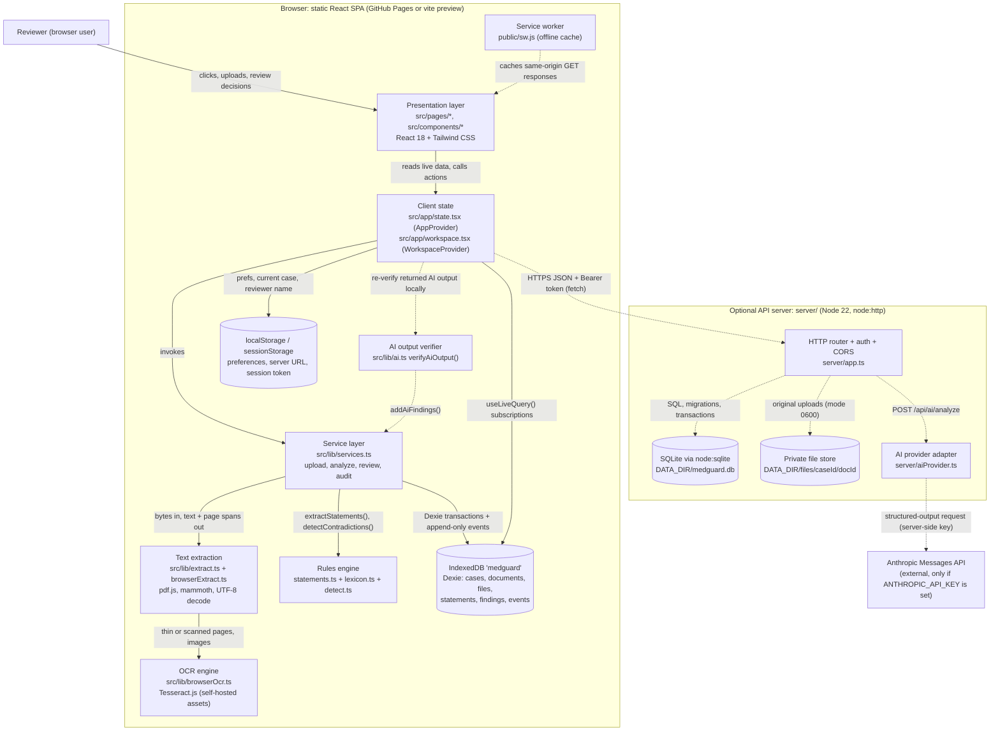
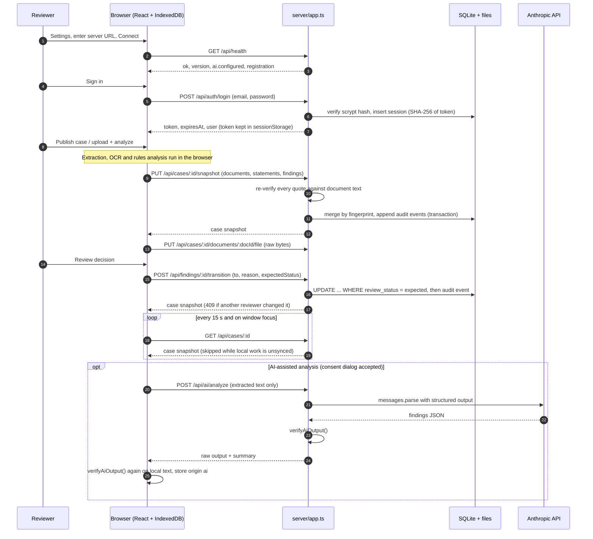
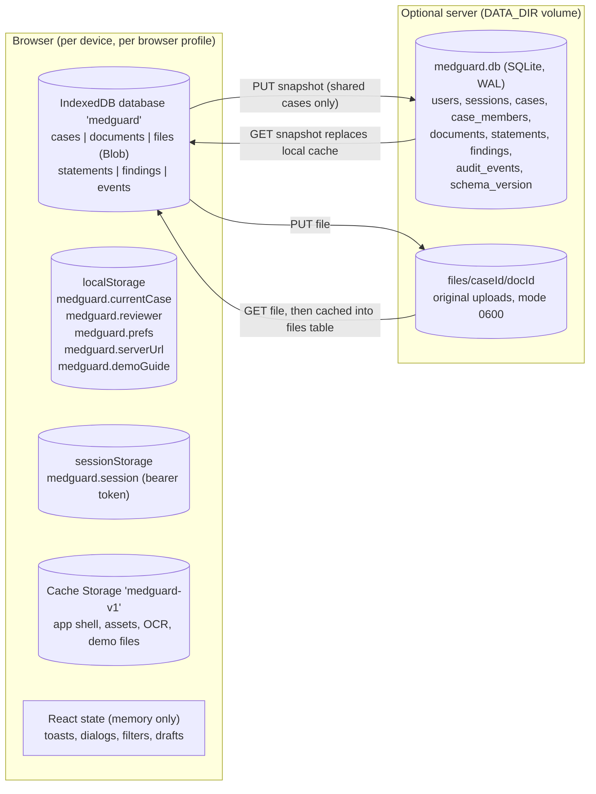
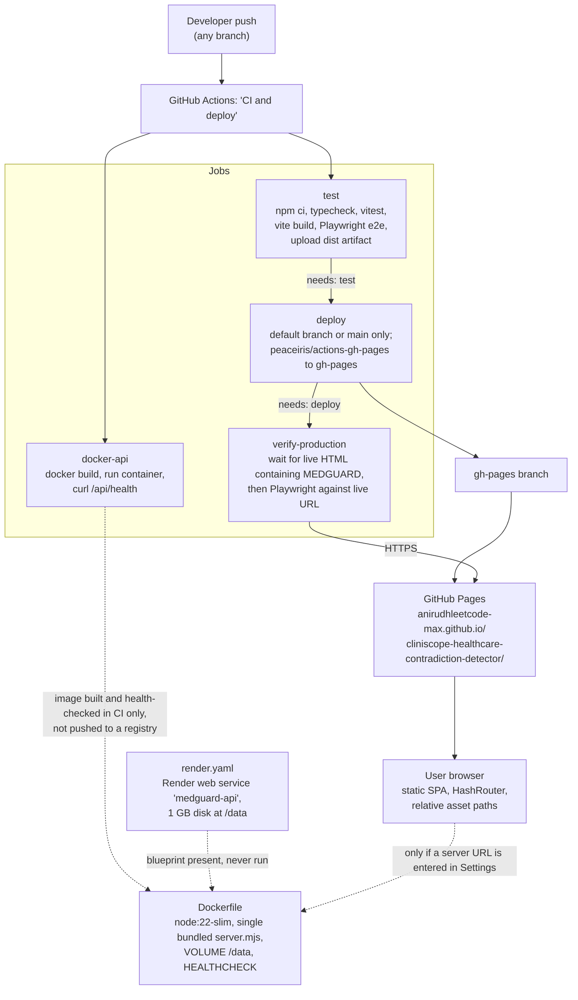
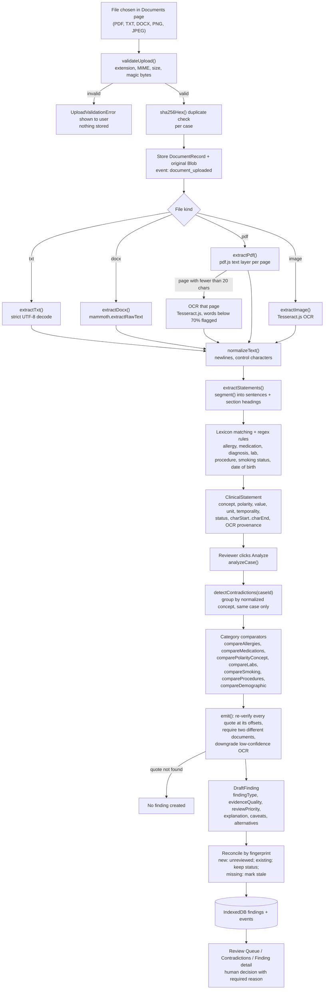

# MEDGUARD — Software Architecture

> Editable diagram sources live in [`diagrams/`](diagrams/). The diagrams below are copies of those files. Earlier, shorter notes are in [`../ARCHITECTURE.md`](../ARCHITECTURE.md).

## 1. System overview

MEDGUARD is a **static, browser-first single-page application**. All core work runs inside the reviewer's browser:

- document ingestion, text extraction, OCR;
- rules-based contradiction detection;
- the review workflow;
- the audit log.

All state is stored in **IndexedDB**. This is the default *local demo mode*, which needs no server, login or API key.

Two **optional** extensions exist and are off by default:

1. **Shared-workspace API server** (`server/`). Node 22 + `node:http` + SQLite. It adds accounts, case sharing with roles, a server-authoritative review state and an append-only audit log.
2. **AI-assisted reasoning.** The server forwards the extracted case text to the Anthropic Messages API, after explicit user consent. Both the server and the browser re-verify every returned quotation against the source text before anything is stored.

## 2. Component responsibilities

| Component | Responsibility | Main files |
|---|---|---|
| App bootstrap and routes | `HashRouter` with 14 routes plus a 404, error boundary, service worker registration | `src/main.tsx` |
| App shell | Sidebar, mobile drawer, header, breadcrumbs, Ctrl/Cmd+K search, notifications, toasts, mode chip | `src/components/shell/AppShell.tsx`, `CommandPalette.tsx`, `BrandMark.tsx` |
| Pages | Overview, Cases, Case workspace, Contradictions, Review Queue, Documents, Document viewer, Finding detail, Activity, Settings/About, Help | `src/pages/*.tsx` |
| Review UI | Side-by-side evidence, allowed actions, required-reason dialog, decision history | `src/components/review/Review.tsx` |
| App state | Current case, reviewer name, prefs, toasts, demo seeding, live-query hooks | `src/app/state.tsx` |
| Workspace state | Server URL, health, session, push/pull/publish, local-vs-server review actions | `src/app/workspace.tsx` |
| Service layer | Every write, each paired with an audit event: create case, upload, analyze, transition, notes, delete, demo seeding, AI findings | `src/lib/services.ts` |
| Extraction | Upload validation, TXT/DOCX/PDF/image extraction, OCR orchestration, offset helpers | `src/lib/extract.ts`, `browserExtract.ts`, `browserOcr.ts` |
| Statement extraction | Segmenting, lexicon matching, negation, temporality, doses, labs, dates | `src/lib/statements.ts`, `lexicon.ts`, `dates.ts` |
| Detection engine | Cross-document comparison, classification, evidence verification, explanations | `src/lib/detect.ts` |
| Review state machine | Allowed transitions (shared 5-state and local 8-state), reason rules | `src/lib/review.ts` |
| AI contract | Output schema, system prompt, quote verification, corroboration | `src/lib/ai.ts`, `aiClient.ts` |
| Remote client | `fetch` wrapper, session storage, snapshot apply/push/pull | `src/lib/remote.ts` |
| Exports | JSON report, CSV, backup, validated restore | `src/lib/exportCase.ts` |
| Metrics / queries | Dashboard numbers, filters, sorting | `src/lib/metrics.ts`, `query.ts` |
| Browser DB | Dexie schema (`medguard`, version 1) | `src/lib/db.ts` |
| API server | Routing, auth, CORS, validation, authorization, audit | `server/app.ts`, `auth.ts`, `config.ts`, `index.ts` |
| Server DB | SQLite schema + migrations + transactions | `server/db.ts` |
| AI provider | Anthropic SDK adapter + error mapping | `server/aiProvider.ts` |

## 3. Diagram A: high-level component architecture

Solid arrows are always present. Dotted arrows exist only when the optional server (and, for AI, an API key) is configured.

**Reading it.** The browser box is the whole product in its default configuration. Note that there is **no** arrow from the browser to any database server: IndexedDB is a browser-local store. The detection engine is browser code too. In shared mode it is still the browser that extracts and analyzes; the server only verifies and persists what it receives.

## 4. Diagram B: frontend-to-backend communication (shared mode only)

**Reading it.** Communication is plain `fetch` over HTTP(S) with JSON bodies and a bearer token. There are no WebSockets or server push. Shared cases refresh by **polling** (`src/app/workspace.tsx`, 15 000 ms interval plus a `focus` listener).

## 5. Diagram C: data-storage architecture

**Reading it.** For a local case, IndexedDB is the system of record. For a shared case, SQLite is authoritative and IndexedDB is a cache; `applySnapshot()` replaces local rows with the server state. Details and persistence rules are in [`DATA_FLOW_AND_WORKFLOW.md`](DATA_FLOW_AND_WORKFLOW.md#4-data-storage-matrix).

### 5.1 IndexedDB schema (`src/lib/db.ts`, Dexie version 1)

| Table | Primary key | Indexes | Content |
|---|---|---|---|
| `cases` | `id` | `createdAt` | `CaseRecord` (label, demo flags, optional `remote` block) |
| `documents` | `id` | `caseId`, `[caseId+contentHash]` | `DocumentRecord` incl. full `extractedText`, page spans, OCR spans |
| `files` | `id` (= document id) | `caseId` | Original upload as `Blob` |
| `statements` | `id` | `caseId`, `documentId` | `ClinicalStatement` with exact char offsets |
| `findings` | `id` | `caseId`, `[caseId+fingerprint]` | `Finding` with evidence, classification, review status, `stale` |
| `events` | `id` | `caseId`, `findingId`, `at` | `AuditEvent`, written with `add()` only (never overwritten by the service layer) |

### 5.2 SQLite schema (`server/db.ts`, migration 1)

| Table | Key / constraints |
|---|---|
| `users` | `id` PK, `email` UNIQUE NOCASE, scrypt `password_hash` |
| `sessions` | `token_hash` PK (SHA-256), `user_id` FK with cascade delete, `expires_at` |
| `cases` | `id` PK, `owner_id` FK |
| `case_members` | PK `(case_id, user_id)`, `role` CHECK in `owner`, `reviewer`, `viewer` |
| `documents` | `id` PK, `case_id` FK with cascade delete, `data_json`, `file_path`, `file_size` |
| `statements` | `id` PK, `case_id` FK, `document_id`, `data_json` |
| `findings` | `id` PK, UNIQUE `(case_id, fingerprint)`, `review_status` CHECK in 5 shared statuses, `stale` |
| `audit_events` | `seq` autoincrement, triggers `audit_no_update` / `audit_no_delete` abort any change |

Pragmas: `journal_mode = WAL`, `foreign_keys = ON`, `busy_timeout = 5000`. Migrations are versioned in `schema_version` and applied in a transaction at start-up. Writes use `BEGIN IMMEDIATE` transactions (`tx()`).

## 6. Diagram D: deployment architecture

**Reading it.** Only the static frontend is deployed. The API image is built and smoke-tested in CI, but it is not published or hosted. See [`DEPLOYMENT_AND_CI_CD.md`](DEPLOYMENT_AND_CI_CD.md).

## 7. Diagram E: contradiction-detection pipeline

**Reading it.** Every step is deterministic TypeScript; there is no trained model in this path. A step-by-step description is in [`DATA_FLOW_AND_WORKFLOW.md`](DATA_FLOW_AND_WORKFLOW.md#3-detection-pipeline-step-by-step).

## 8. Key architectural decisions (as implemented)

| Decision | Consequence | Evidence |
|---|---|---|
| Browser-first, no mandatory backend | Works on static hosting and offline. Data is per-browser and single-user in local mode | `src/lib/db.ts`, `public/sw.js` |
| `HashRouter` + `base: './'` | Deep links and assets work under the GitHub Pages sub-path `/cliniscope-healthcare-contradiction-detector/` with no server rewrites | `src/main.tsx`, `vite.config.ts`, built `dist/index.html` uses `./assets/...` |
| Self-hosted pdf.js worker, OCR worker, WASM and language data | No third-party CDN at runtime. Compatible with the strict CSP (`script-src 'self' 'wasm-unsafe-eval'`) | `scripts/copy-pdf-worker.mjs`, `index.html` CSP |
| Pure functions with injected parsers | The same extraction and detection code runs in the browser and in Node tests (real pdf.js, mammoth, Tesseract) | `src/lib/extract.ts` header comment, `tests/unit/*` |
| Evidence = exact character offsets | Every quote is re-verifiable (detection, server sync, backup restore, AI verification) | `detect.ts:35`, `app.ts:221-241`, `exportCase.ts:144`, `ai.ts:118` |
| Append-only audit | Each state change writes an event. On the server, DB triggers forbid edits | `services.ts:42-46`, `server/db.ts` |
| Fingerprint reconciliation | Re-analysis keeps review state. Findings that are no longer produced become `stale`, never deleted | `services.ts:229-298` |

> **Correction to the older notes.** `../ARCHITECTURE.md` says "Rules re-analysis never supersedes AI findings". The current code supersedes an AI finding (marks it `stale`) during a rules re-run when one of its source documents has been removed from the case (`services.ts:259-270`; covered by `tests/unit/sync.test.ts` "AI findings are superseded when a source document is removed"). Otherwise, AI findings are left untouched.
| Shared code between browser and server | `src/lib/types.ts`, `review.ts`, `ai.ts` are imported by `server/` | `server/app.ts:11-13` |
