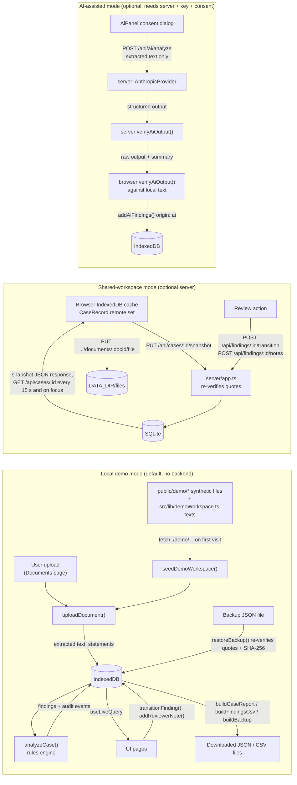
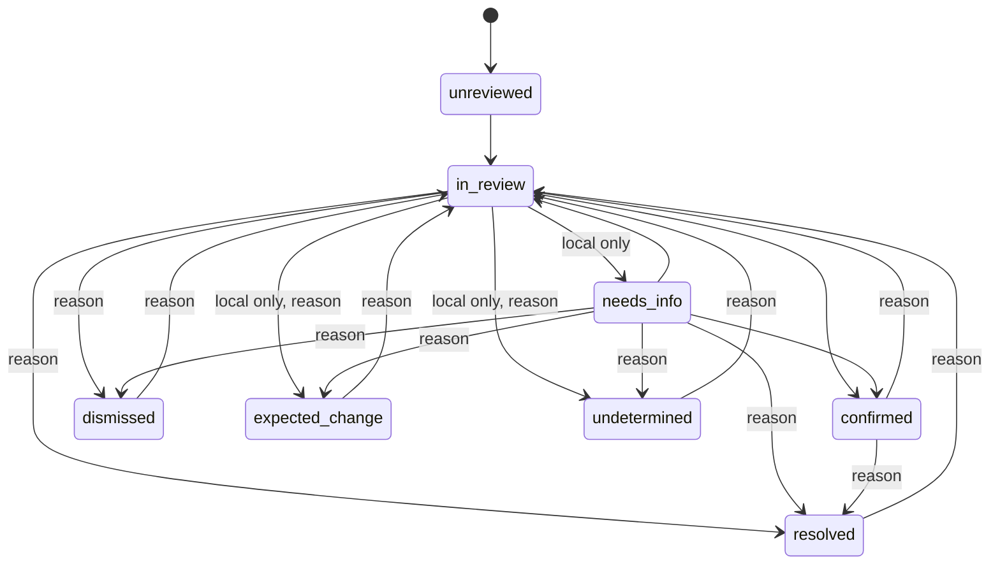

# MEDGUARD — Data Flow and Workflow

> **Database update (after this audit):** the optional server now uses **PostgreSQL** instead of SQLite: an external server via `DATABASE_URL` (a free Neon project in the prepared deployment), or embedded PGlite for local use. Original files are stored in the database (`document_files`, schema v3). Where this page says SQLite, `node:sqlite`, `medguard.db` or a files directory, read PostgreSQL / `document_files`; the tables, constraints, roles and append-only triggers are otherwise unchanged. Current sources: [`docs/backend/DATABASE_ARCHITECTURE.md`](../backend/DATABASE_ARCHITECTURE.md) and [`docs/backend/DEPLOYMENT.md`](../backend/DEPLOYMENT.md).

> Diagram sources: [`diagrams/data_flow.mmd`](diagrams/data_flow.mmd), [`diagrams/detection_pipeline.mmd`](diagrams/detection_pipeline.mmd).

## 1. Execution modes

| Mode | Default? | What runs where | How to enter it |
|---|---|---|---|
| **Local demo mode** | Yes | Everything in the browser. Data in IndexedDB. No network calls except the app's own static files | Open the app. On an empty database it seeds the synthetic workspace automatically (`src/app/state.tsx:117-125`) |
| **Shared-workspace mode** | No | Extraction and analysis still run in the browser. The server verifies and persists, and is authoritative for review status and audit | Settings → Shared workspace → enter server URL → Connect → sign in. Then create or publish a shared case |
| **AI-assisted analysis** | No | Server calls Anthropic. Browser re-verifies the output | Requires shared mode, a server with `ANTHROPIC_API_KEY`, and the consent dialog in `AiPanel` |

The header chip always shows the mode of the current case: **"Local demo mode"** or **"Shared workspace · role"** (`AppShell.tsx`, `data-testid="mode-chip"`). A locally computed result is never presented as server output.

## 2. Data flow

## 3. Detection pipeline, step by step

The engine is **deterministic and rules-based**: lexicons plus regular expressions plus structured comparison. It is not a trained ML model and does not use NLP libraries. The only AI component is the optional, separately labelled AI-assisted pass in §3.13.

| # | Stage | What happens | Evidence |
|---|---|---|---|
| 1 | **Entry** | A file arrives via the Documents page file picker or drag-and-drop, or via demo seeding (`fetch('./demo/…')` for 5 files; inline text for 11 more records in 5 extra cases (16 records in 6 cases in total)). | `src/pages/Documents.tsx:96, 152`, `src/app/state.tsx:49-57`, `src/lib/demoWorkspace.ts` |
| 2 | **Validation** | Checks performed: extension whitelist (pdf, txt, docx, png, jpg, jpeg); MIME/extension consistency; non-empty; size ≤ `VITE_MAX_UPLOAD_MB` (default 10 MB); magic bytes (`%PDF-`, `PK`, PNG/JPEG signatures). Filenames are sanitized. Duplicates (same SHA-256 within a case) are rejected. | `extract.ts:32-90`, `services.ts:90-98` |
| 3 | **Text extraction** | **TXT:** strict UTF-8. **DOCX:** mammoth raw text. **PDF:** pdf.js text layer, rebuilt line by line from y-coordinates. Any page with fewer than 20 non-space characters is OCR'd with Tesseract.js at about 200 DPI. **PNG/JPEG:** OCR. Timeouts: 30 s for a PDF without OCR, 180 s with OCR, 90 s per OCR page or image. | `extract.ts:123-381`, `browserOcr.ts` |
| 4 | **Normalization** | Removes the BOM, normalizes CRLF to LF, strips control characters and trailing spaces, collapses 3+ blank lines. Records PDF page spans (`{page, start, end, method, ocrConfidence}`), OCR regions, and OCR words below **70%** confidence. | `extract.ts:100-107, 179-199, 275-289` |
| 5 | **Segmentation** | Splits text into sentence-like segments with exact offsets. Tracks the section heading each segment falls under (CAPS headings, `Heading:` lines and inline `Allergies: …`), and maps headings to hints (allergy, medication, family, social, procedure, lab, diagnosis). | `statements.ts:50-114`, `lexicon.ts:110-118` |
| 6 | **Fact identification** | Per segment, rule extractors run against fixed lexicons: 14 allergens, 26 medications, 14 diagnoses, 10 lab tests and 7 procedures (130 surface terms in total). Also: "no known drug allergies", smoking status, date of birth. Family-history segments are skipped (not about the patient). | `statements.ts:187-383, 405-462`, `lexicon.ts` |
| 7 | **Attribute extraction** | Detected attributes: polarity (negation within 40 characters before the term); uncertainty terms (possible, unverified, ?); historical/resolved wording; discontinuation; documented change ("increased … from 10 mg"); dose and unit (normalized to mg); frequency; route; lab value and unit; event or specimen dates. A unit with no readable number sets `valueUnreadable`. | `statements.ts:116-185, 222-263, 295-328` |
| 8 | **Statement record** | Each `ClinicalStatement` stores `originalText = extractedText.slice(charStart, charEnd)`, page (PDF only, from verified spans), line or paragraph, section, an extraction confidence (high, moderate or low), and OCR provenance. OCR text is never rated *high*. Statement IDs are deterministic hashes. | `statements.ts:385-462`, `types.ts:144-184` |
| 9 | **Comparison** | Runs only when the reviewer clicks **Analyze documents**. `detectContradictions(caseId)` ignores statements and documents from other cases, groups by normalized concept, and runs one comparator per category (table below). | `detect.ts:607-629`, `components/AnalyzeButton.tsx` |
| 10 | **Evidence verification** | `emit()` drops any statement whose quote no longer matches its document offsets. It requires both sides to come from at least one different document (cross-document only). A finding touching a low-confidence OCR word becomes *insufficient evidence*. | `detect.ts:35-38, 124-190` |
| 11 | **Classification and explanation** | Each finding gets: `findingType`; `evidenceQuality` (high, moderate, limited, insufficient) with a reason; `reviewPriority` (prompt, routine, low); an explanation; a comparison reason; contextual caveats (including the date gap between documents); and alternative explanations. Display ID `CS-XXXX`. | `detect.ts:74-122, 192-209` |
| 12 | **Reconciliation and persistence** | Matching uses `fingerprint = hash(caseId, concept, sorted statementIds)`. A **new** fingerprint creates an `unreviewed` finding and a `finding_created` event. An **existing** one is updated but keeps its review status. A finding **no longer produced** is marked `stale`, never deleted. Runs inside one Dexie transaction. Concurrent runs for the same case share one promise. | `services.ts:207-298` |
| 13 | **Optional AI pass** | The server prompts the model with all extracted text and the existing rules findings. The output must match `AiOutputSchema` (Zod). `verifyAiOutput()` keeps only quotes found **verbatim** (or matching after whitespace normalization only) in that document's text. It rejects unknown documents, downgrades one-sided "conflicts" and low-OCR quotes, and filters dates to those literally present. The browser repeats the verification, skips findings that only restate an existing rules finding (`corroborates()`), and stores the rest as `origin: 'ai'`, `AI-XXXX`, `unreviewed`. | `src/lib/ai.ts`, `src/lib/aiClient.ts`, `services.ts:454-485` |

### 3.1 Comparators and the finding types they produce

| Comparator | Compares | Possible finding types |
|---|---|---|
| `compareAllergies` (`detect.ts:212`) | Specific allergen (positive) vs "no known drug allergies" or a specific negation, from another document | `explicit_conflict` (asserted); `context_dependent` (historical/outgrown); `insufficient_evidence` (hedged) |
| `compareMedications` (`detect.ts:288`) | Same drug across documents: dose in mg, frequency, units, discontinuation dates, unreadable dose | `potential_discrepancy` (different dose or frequency); `context_dependent` (documented change whose prior value matches); `insufficient_evidence` (non-comparable units or unreadable dose); `temporal_inconsistency` (active in a record dated *after* a discontinuation) |
| `comparePolarityConcept` (`detect.ts:426`) | Diagnosis affirmed vs explicitly negated | `explicit_conflict`, `context_dependent`, `insufficient_evidence` |
| `compareLabs` (`detect.ts:484`) | Same test **and same full specimen date** | `potential_discrepancy` (different value); `insufficient_evidence` (different units). Different dates are **not** flagged (counted as temporally explained) |
| `compareSmoking` (`detect.ts:525`) | never / former / current | never vs current or former → `explicit_conflict`; former vs current → `context_dependent` |
| `compareProcedures` (`detect.ts:555`) | Specific procedure vs "no prior surgery" | `explicit_conflict` |
| `compareDemographic` (`detect.ts:577`) | Explicitly labelled date of birth (full dates only) | `explicit_conflict` |

### 3.2 Worked example (synthetic case DEMO-0042, asserted in `tests/unit/detect.test.ts` and `export.test.ts`)

**Inputs**

- The *Discharge Summary* PDF (12 Mar 2026), under its ALLERGIES heading, records a penicillin allergy.
- The *Patient Intake Form* DOCX (15 Mar 2026) contains "No known drug allergies".

**Processing**

1. Extraction produces statement `allergy:penicillin` (polarity positive, status active, confidence high) and statement `allergy:any-drug` (polarity negative).
2. `compareAllergies` sees a certain positive and a negative in a different document, and emits an **explicit conflict**: "Penicillin allergy documented in one record, absent in another".
3. The finding's side A and side B quotes are exact slices, with page numbers only where they are verified.

**Caveats attached to the finding**

- The date gap between the documents.
- That "No known drug allergies" records what was known when the document was written.
- Three alternative explanations.

**Outcome.** Priority: *prompt review suggested*. The explanation states that the system cannot determine which statement is correct.

### 3.3 Interpretation vocabulary

| Term | How MEDGUARD represents it |
|---|---|
| **Detected inconsistency** | Any active finding with status `unreviewed`. It is a *candidate*, produced by rules or AI. The UI and exports call it a potential contradiction, not a fact |
| **Confirmed clinical contradiction** | Only a human can set this: review status `confirmed` ("Confirmed discrepancy"). It records that the documents disagree, not which one is medically correct (`Review.tsx` `ACTION_META.confirmed`) |
| **Harmless temporal change** | Engine side: `context_dependent` type (for example, a documented dose increase), or not flagged at all (labs on different dates; a medication active *before* a later discontinuation). Reviewer side: status `expected_change` (local mode) |
| **Insufficient evidence** | `findingType: 'insufficient_evidence'` with `evidenceQuality: 'limited'`. Used for hedged wording, unreadable values, non-comparable units, low-confidence OCR, one-sided AI claims |
| **Requires human review** | Every finding. There is no auto-resolution path. Statuses `unreviewed`, `in_review` and `needs_info` count as pending (`review.ts:43`) |
| **Cannot determine** | The engine never guesses. It emits *insufficient evidence*, or no finding when evidence cannot be re-located. The reviewer can record `undetermined` ("Unable to determine", reason required) |

MEDGUARD does not diagnose, recommend treatment, or decide which record is correct. This is stated in the AI system prompt (`ai.ts:51`), in every engine explanation (`NEEDS_REVIEW`, `detect.ts:209`), and in the Settings page.

## 4. Data storage matrix

| Data | Storage location | Persistence | Server-side? | Survives refresh? | Shared across users/devices? | Reset / backup / deletion |
|---|---|---|---|---|---|---|
| Cases, documents (incl. full extracted text), statements, findings, audit events (local cases) | IndexedDB `medguard` (Dexie) | Until the case is deleted or browser site data is cleared | No | Yes (asserted by e2e "survives a refresh") | No: one browser profile only | Delete case (Cases page); delete document; "Reset demonstration" removes and recreates **demo** cases only; JSON **Full backup** and validated restore as a new case |
| Original uploaded files (local) | IndexedDB `files` table (`Blob`) | Same as above | No | Yes | No | Deleted with the document or case; included (base64) in Full backup |
| Seeded synthetic demonstration data | Source: `public/demo/*` (5 files) + `src/lib/demoWorkspace.ts` (16 text records). Stored into IndexedDB on first visit | As above | No | Yes | Each browser seeds its own copy | Reset demonstration |
| Preferences, current case, reviewer display name, server URL | `localStorage` keys `medguard.prefs`, `medguard.currentCase`, `medguard.reviewer`, `medguard.serverUrl`, `medguard.demoGuide` (guided-tour progress) | Until cleared | No | Yes | No | Cleared with site data; failures are tolerated (try/catch) |
| Shared-workspace bearer token | `sessionStorage` key `medguard.session` | Until the tab closes or the session expires (default 8 h) | Token hash on server | Yes within the tab | No | Sign out revokes it server-side |
| UI-only state (filters, dialogs, drafts, toasts) | React memory | Lost on reload | No | No | No | n/a |
| Offline asset cache | Cache Storage `medguard-v1` (service worker) | Until a new cache name or the user clears it | No | Yes | No | Old caches deleted on activate |
| Shared cases, members, users, sessions, audit | SQLite `DATA_DIR/medguard.db` | Durable on the server volume | **Yes** (only if a server is run) | Yes | Yes, for case members | No delete-case or user-delete endpoint; audit rows cannot be updated or deleted; backup of the volume is **not implemented** (operator responsibility) |
| Shared original files | `DATA_DIR/files/<caseId>/<docId>`, mode 0600 | Durable on the server volume | **Yes** | Yes | Case members (viewer+) | Removed when the document is removed via snapshot `removedDocumentIds` |
| AI request payload | Transient in server memory, sent to Anthropic | Not stored by MEDGUARD | Passes through the server | n/a | n/a | Provider-side retention: **UNKNOWN**, depends on the operator's account |

No external database (PostgreSQL, MongoDB and similar) exists. **Local browser storage is not a production database.** It is per-device, unencrypted beyond what the browser provides, and has no backup unless the user exports one.

## 5. End-to-end user workflow (local demo mode)

These steps were verified against the routes in `src/main.tsx` and against the e2e specs `tests/e2e/journey.spec.ts`, `workflow.spec.ts` and `workspace.spec.ts`. All three passed in this audit.

| Step | User action | Frontend behaviour | Engine / service | Data change | Visible result |
|---|---|---|---|---|---|
| 1 | Open MEDGUARD | `AppProvider` loads cases via `useLiveQuery`. If none, `resetDemo()` starts | `seedDemoWorkspace()`: DEMO-0042 ingested (not analysed); 5 more cases ingested and analysed; a few labelled seeded decisions applied | IndexedDB populated; events `case_created`, `document_uploaded`, `document_extracted`, … | Seeding progress (per document, OCR download note), then the **Clinical Overview** (`#/`) |
| 2 | Read the dashboard | `Overview` computes `workspaceMetrics()` | none | none | Metric cards (Cases Reviewed, Open Contradictions, Pending Reviews, Documents Processed), category bar list, status donut |
| 3 | Open a case (`#/cases` → `#/cases/:id`) | `Cases` table with search, filter and sort; `CaseDetail` three-column workspace | none | `localStorage.medguard.currentCase` | Documents, findings and analysis summary for that case |
| 4 | Inspect documents (`#/documents`, `#/documents/:id`) | `DocumentViewer` shows extracted text with highlighted evidence, extraction method, warnings, OCR confidence; can render the original page or image locally | `getOriginalBlob()` | none | Exact text, plus "View original" (object URL, PDF opened in a new tab, others downloaded) |
| 5 | Click **Analyze documents** | `AnalyzeButton` → `analyzeCase()` | `detectContradictions()` + reconciliation | Findings and events written in one transaction | Toast "Analysis complete: N statements, M comparisons, K finding(s)"; analysis summary card |
| 6 | Open a finding (`#/findings/:id`, or the drawer on `#/contradictions`) | `EvidenceComparison` shows side A / side B quotes, document, date, verified page | none | none | Explanation, caveats, alternatives, evidence quality, priority, relevant dates |
| 7 | "View in source" | Navigates to the document with the character range highlighted (`mark.evidence-hl`) | none | none | Scrolls to the highlighted passage |
| 8 | Choose an outcome | `ReviewPanel` offers `allowedActions()`; from `unreviewed`, `decide()` first moves to `in_review` (two audited transitions) | `validateTransition()` (local table): reason ≥ 5 chars required for resolve, dismiss, expected change, undetermined and reopen | `findings.reviewStatus` updated; `status_changed` event(s) with reason and actor | Status badge changes; queue count updates |
| 9 | Add a note | `addReviewerNote()` (1-4000 chars) | none | `note_added` event | Note appears in decision history |
| 10 | Dashboards update | `useLiveQuery` re-runs on write | none | none | Review Queue (`#/queue`), Overview metrics and Activity (`#/activity`) reflect the change immediately (asserted in `workspace.spec.ts:73`) |
| 11 | Reload the page | State is re-read from IndexedDB | none | none | Decision, reason and note still present (asserted in `workflow.spec.ts:55`) |
| 12 | Export | `ExportPanel`: case report (JSON), findings (CSV, formula-neutralised), full backup (JSON with base64 originals) | `exportCase.ts` | none | Files named `medguard-<case>-<kind>-<date>[-SYNTHETIC].<ext>` |

**Reviewer identity in local mode.** The reviewer is a free-text display name ("Demo Reviewer (unauthenticated demo identity)" by default). It is **not authenticated**.

## 6. Shared-workspace workflow (differences only)

1. **Connect.** Settings → Shared workspace: enter the URL. `GET /api/health` shows the version, whether AI is configured, and whether registration is open.
2. **Account.** Register (only if the server allows it) or sign in. The token is stored in `sessionStorage`.
3. **Create or publish a case.** Create a new shared case, or publish a local case. Publishing is refused if the local case already has review decisions or notes, because they cannot be carried into the server audit trail (`workspace.tsx` `publishCase`).
4. **Upload and analyze.** Both still run in the browser. Each change is pushed with `PUT …/snapshot`, then the original files are uploaded. While a push is pending, the case is marked `unsynced` and background pulls are suspended.
5. **Review.** Actions call `POST /api/findings/:id/transition`. Only the five shared statuses are allowed: `needs_info`, `expected_change` and `undetermined` are **local-only**. A stale `expectedStatus` yields 409, and the client re-pulls.
6. **Collaboration.** The owner adds members by email as reviewer or viewer. Other members see changes on the next poll (15 s) or on window focus.
7. **AI analysis.** Optional, reviewer or owner. A consent modal names the server URL and the provider/model before any text is sent.

## 7. Review lifecycle

Source: `TRANSITIONS` (shared, 5 states) and `LOCAL_TRANSITIONS` (8 states) in `src/lib/review.ts`. The server enforces `TRANSITIONS` plus a database CHECK constraint on `findings.review_status`.
